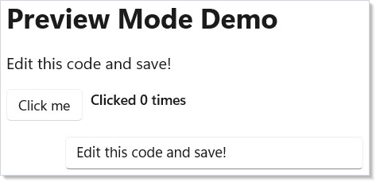

Microsoft.UI.Reactor (Reactor)'s development workflow is built around fast feedback. The
runtime is designed to surface the work it is doing — every render,
every reconcile, every effect, every dispatcher hop — through a small
set of dedicated tools so you can see, attribute, and reason about
what your app is doing without a profiler. The `mur` CLI, preview
mode under `dotnet watch`, the MCP server, the VS Code panel, the
in-app dev menu, and the reconcile-highlight overlay
are all variants of the same idea: the runtime publishes its work,
and the inner loop lets you read it. The cost is zero in retail —
every devtools entry point lives behind a build-time capability switch
(`Reactor.DevtoolsSupport`) plus a session-time opt-in (`--devtools app`)
so end users never see anything you don't intend to ship.

# Dev Tooling

Reactor's inner loop centers on `dotnet watch` and preview mode: you edit
code, save, and see changes in a running window — no manual restart, no
state-resetting class reload most of the time. Surrounding that loop are
five complementary surfaces — the [`mur` CLI](#the-mur-cli), the
[MCP server](#mcp-server), the [VS Code panel](#vs-code-panel), the
[in-app dev menu](#in-app-dev-menu), and the
[runtime overlays](#runtime-overlays) — each of which lights up only
when you ask for it.

## Preview Mode

Launch the app from `dotnet watch` to use Reactor's hot-reload-friendly
preview workflow:

```csharp
// Program entry point — this is the entire App.cs file:
// ReactorApp.Run<DevToolingApp>("Dev Tooling Demo",
//     width: 600, height: 450
// );
//
// Hot reload works when the app is launched under dotnet watch. Devtools
// screenshot capture is enabled by the app project's Reactor.DevtoolsSupport
// switch and activated by launching with --devtools.
```

The app entry point is an ordinary `ReactorApp.Run` call; there is no
`preview:` or `devtools:` argument. Devtools-specific screenshot capture is
enabled by the app project's `Reactor.DevtoolsSupport` switch and activated
at launch with `--devtools`.

## Running with Hot Reload

Start your app with `dotnet watch`:

<!-- ai:lock -->
```
dotnet watch run
```
<!-- /ai:lock -->

This launches the app and watches your `.cs` files for changes. When you
save, `dotnet watch` recompiles and Reactor re-renders the component tree
in place — the same window, the same process. For most edits your live
state survives the reload.

Here's what the preview app looks like running:

```csharp
class DevToolingApp : Component
{
    public override Element Render()
    {
        var (count, setCount) = UseState(0);
        var (message, setMessage) = UseState("Edit this code and save!");

        return VStack(16,
            Heading("Preview Mode Demo"),
            TextBlock(message).FontSize(16),
            HStack(8,
                Button("Click me", () => setCount(count + 1)),
                TextBlock($"Clicked {count} times").SemiBold()
            ),
            TextBox(message, setMessage, placeholderText: "Type something")
                .Width(300)
        ).Padding(24);
    }
}
```



Edit the `message` default value or add a new element, save the file, and
watch the window update.

### What state survives a reload

Reactor migrates live state across a hot reload instead of resetting it.
When you save, the runtime re-runs `Render()` against the existing
[`RenderContext`](hooks.md) and reconciles the result onto the live
controls. Hook cells are matched **by call order**, so `UseState`,
`UseReducer`, `UseRef`, `UseMemo`, and `UsePersisted` keep their values
as long as the hook sequence is unchanged. When you edit a record or
class that a hook stores, the runtime migrates the value field-by-field
onto the new shape; fields it can't map are dropped (with a log line)
rather than throwing. When you rename or change the type of a component,
Reactor migrates the subtree onto the new component instance, preserving
its hook state and the underlying WinUI controls.

| Edit you make | What happens to state |
|---|---|
| Change a `Render()` body, add/remove/reorder elements | Preserved — controls patched in place |
| Edit a value-type or record stored in a hook | Preserved — migrated field-by-field; unmappable fields dropped |
| Rename a component type / change its identity | Preserved — subtree migrated onto the new instance |
| **Add, remove, or reorder hook calls** | Reset — the hook list is cleared and re-mounted fresh |

The last row is the unavoidable case: changing the hook *shape* means the
old values can't be re-keyed onto the new layout, so Reactor runs pending
cleanups and re-mounts hooks from scratch to keep the loop alive instead
of leaving you at an error fallback.

> **Caveat:** Effects whose dependencies didn't change across a reload keep the cleanup
> closure they captured from the previous instance. This matches React's
> identity semantics and is harmless for state-capturing effects, but if an
> effect must re-run on every reload, give it a dependency that changes. For
> state you explicitly want to survive even a hook-shape change, use
> `UsePersisted` with `PersistedScope.Window` or store the value in an
> `Observable<T>` field — see [persistence](persistence.md).

### When migration misbehaves

State migration is best-effort. If an unusual edit leaves a component in a
bad state, force a clean "lose everything, remount fresh" reload from your
app: call `HotReloadService.ResetAllContexts()`, which runs every live
context's pending cleanups, clears its hook list, and re-renders so hooks
re-mount from scratch. Reach for it only when the targeted migration above
doesn't produce the result you expect.

### NativeAOT builds

State migration relies on .NET Hot Reload, which is only available in
JIT debug builds. Under NativeAOT (`PublishAot=true`)
`MetadataUpdater.IsSupported` is `false`, so the whole migration subsystem
is statically dead and trims away — there is no hot-reload loop and no
overhead in a published app.

## Function Component Entry Point

For quick experiments, skip the class entirely. Pass a lambda to
[`ReactorApp.Run`](components.md):

```csharp
// Alternative: inline function component, no class needed
// ReactorApp.Run("Quick Test", ctx =>
// {
//     var (n, setN) = ctx.UseState(0);
//     return VStack(12,
//         TextBlock($"Count: {n}").FontSize(20),
//         Button("+1", () => setN(n + 1))
//     ).Padding(24);
// }, width: 400, height: 300);
```

This is useful for throwaway prototypes or testing a single interaction.
You get the same hot-reload behavior — edit the lambda, save, see the
result. The [recipes folder](recipes/index.md) collects more elaborate
examples that fit this shape.

## The `mur` CLI

`mur` is Reactor's repo-aware command-line tool. It is the canonical
entry point for the doc pipeline, the localization workflow, the
devtools server, and a handful of repo-maintenance utilities. The
subcommands map one-to-one to the workflows below.

| Subcommand | Purpose | Common invocation |
|------------|---------|-------------------|
| `mur docs` | Compile the docset (templates + doc apps → `docs/guide/`) | `mur docs compile` |
| `mur docs render-diagrams` | Render `.mmd` Mermaid diagrams to `.svg` for fast inner-loop iteration | `mur docs render-diagrams --topic architecture-overview` |
| `mur docs new-diagram <topic> <id>` | Scaffold a new Mermaid `.mmd` for a topic | `mur docs new-diagram hooks slot-table` |
| `mur loc` | Run the localization pipeline (extract strings, validate `.resw`, generate manifests) | `mur loc extract` |
| `mur devtools` | Start the MCP server for VS Code or agent integration | `mur devtools serve` |
| `mur check` | Repo-health checks (cref validity, namespace policy, "did you mean" suggestions) | `mur check` |
| `mur pack-local` / `mur clean-local` | Package / clean the local NuGet feed for samples that consume `Microsoft.UI.Reactor` as a package | `mur pack-local` |

`mur docs compile` is the workflow you reach for most often. See
[the doc-pipeline contributor guide](https://github.com/microsoft/microsoft-ui-reactor/blob/main/docs/contributing/doc-pipeline.md)
for the full surface and the `--validate-only`, `--skip-screenshots`,
`--skip-diagrams`, `--skip-reference`, and `--tier=<stub|solid|comprehensive>`
flags that make the inner loop fast.

## MCP Server

`mur devtools serve` starts a [Model Context Protocol](https://modelcontextprotocol.io/)
server that surfaces a small inventory of the running Reactor universe to
an external agent or editor: the doc topic list, the API reference index,
diagnostic-rule descriptions, and a `compile` action that wraps
`mur docs compile`. The server is **not** auto-started by `dotnet watch` —
you launch it explicitly when you want agent integration.

The deeper protocol surface lives in
[DevTools Internals](devtools-internals.md). The
[`docs/contributing/devtools.md`](https://github.com/microsoft/microsoft-ui-reactor/blob/main/docs/contributing/devtools.md) guide is
the operational reference (how to plug it into Claude Desktop / VS Code).

## VS Code Panel

The Reactor VS Code extension lives in `src/vscode-reactor/` and provides
a side panel that:

- Lists the running app's component tree.
- Highlights the source line for any element you click in the tree.
- Renders the latest screenshot capture next to your editor (the same
  PNGs the doc pipeline produces).
- Exposes a "compile docs" button that shells out to `mur docs compile`.

The extension talks to the MCP server (above), so a panel session is
just a long-lived `mur devtools serve` plus a UI on top. Reactor has
no special editor requirement beyond the standard C# Dev Kit — the
panel is additive.

## In-App Dev Menu

For the dev surface that lives **inside** a running app — a "Dev" item
in the titlebar, debug overlays you can toggle, one-off commands —
Reactor exposes three small primitives: `UseDevtools()`,
`DevtoolsMenu(...)`, and `Observable<T>`. Two independent signals
combine:

1. **Build-time capability** — add the feature switch to the app project:

   ```xml
   <ItemGroup>
     <RuntimeHostConfigurationOption Include="Reactor.DevtoolsSupport"
                                     Value="true" Trim="true" />
   </ItemGroup>
   ```

   This is a capability gate — it does **not** by itself show any dev
   UI. Samples typically enable it only in Debug builds so Release/AOT
   binaries keep the devtools code trimmed.

2. **Session opt-in** — run the app with `--devtools app`:

   ```
   myapp.exe --devtools app
   ```

`UseDevtools()` returns `true` only when **both** are present. Gate
any dev-only element with a ternary in `Render()`:

```csharp
public override Element Render()
{
    var dev = ctx.UseDevtools();
    return VStack(
        MainContent(),
        dev ? DebugOverlay() : null
    );
}
```

`DebugOverlay()` is only **constructed** when `dev` is true. In retail
that line costs one bool read plus one branch — no element tree
allocated, no children reconciled. The cost model carries over to
[`DevtoolsMenu`](devtools-internals.md), which renders itself as a
titlebar item only when `UseDevtools()` is true:

```csharp
class TitleBar : Component
{
    public override Element Render() => HStack(
        Text("My App"), Spacer(),
        DevtoolsMenu(() => new MenuFlyoutItemBase[]
        {
            ToggleMenuItem("Debug UI",
                AppFlags.DebugUI.Value,
                v => AppFlags.DebugUI.Value = v),
            MenuSeparator(),
            MenuItem("Clear cache", () => CacheService.Clear()),
            MenuItem("Reload",      () => Application.Current.Reload()),
        })
    );
}
```

`Observable<T>` is the lightweight INPC cell that backs flags like
`AppFlags.DebugUI`. Declare them as `static readonly` fields:

```csharp
public static class AppFlags
{
    public static readonly Observable<bool> DebugUI   = new(false);
    public static readonly Observable<bool> SlowMode  = new(false);
    public static readonly Observable<bool> ForceDark = new(false);
}
```

Any component that wants to react to changes subscribes via
`ctx.UseObservable(AppFlags.DebugUI).Value` — see
[Advanced Patterns](advanced.md) for the broader observable-binding
story.

## Runtime Overlays

The reconcile-highlight overlay attaches to a running app when devtools are on:

- **Reconcile-highlight overlay.** Flashes a rectangle around any
  element that the reconciler patched on the most recent render. Useful
  for catching unintended re-renders (the [Rules of Reactor](rules-of-reactor.md)
  page covers the most common causes).

The overlay renders under the `DevtoolsMenu` toggle group. It is
zero-cost when off.

## The Iteration Cycle

The full inner loop:

1. **Run** `dotnet watch run` in your terminal.
2. **Edit** a component in your editor (with the VS Code panel open
   if you want screenshots and the component tree alongside).
3. **Save** the file — `dotnet watch` detects the change and recompiles.
4. **See** the updated UI in the running window.

No build step to invoke manually. The app stays running and the window
stays positioned where you left it.

```csharp
class IterationDemo : Component
{
    public override Element Render()
    {
        var (items, updateItems) = UseReducer(new List<string>());
        var (input, setInput) = UseState("");

        return VStack(12,
            Heading("Iteration Cycle Demo"),
            TextBlock("Add items, then edit this code and save to see hot reload."),
            HStack(8,
                TextBox(input, setInput, placeholderText: "New item")
                    .Width(200),
                Button("Add", () =>
                {
                    if (!string.IsNullOrWhiteSpace(input))
                    {
                        updateItems(list =>
                        {
                            var next = new List<string>(list) { input };
                            return next;
                        });
                        setInput("");
                    }
                })
            ),
            ForEach(items, item => TextBlock($"  - {item}"))
        ).Padding(24);
    }
}
```


## Patterns

### Per-feature debug flag with a Dev menu toggle

Declare a flag as an `Observable<bool>` in a static class, expose it
through the Dev menu's `ToggleMenuItem`, and read it from any component
via `ctx.UseObservable(...)`. Flipping the flag re-renders every
subscribed component — no event-wiring boilerplate. The pattern scales
to a dozen flags without a config UI.

### Headless screenshot capture for docs

The same devtools plumbing the doc pipeline uses is available to
your own app: enable `Reactor.DevtoolsSupport` in the app project and
launch the app with `--devtools run` so the screenshot harness can
capture the window. See
[`docs/contributing/doc-pipeline.md`](https://github.com/microsoft/microsoft-ui-reactor/blob/main/docs/contributing/doc-pipeline.md)
for the harness contract. This is how every page in the docset gets
its screenshots automatically without an author launching the app by
hand.

## Common Mistakes

### Enabling the switch without a session gate

Forgetting that `Reactor.DevtoolsSupport` is the **capability** gate
and `--devtools app` is the **activation** gate is the most common
mistake. A binary built with the switch enabled shows no dev UI to a
user — the session-time flag does. If you want devtools trimmed out of
retail, keep the switch Debug-only instead of enabling it for Release/AOT.

### Wiring real app state through `UseState` during inner-loop work

`UseState` resets on every hot reload. If your loop depends on a
30-second login flow to reach the screen you are iterating on, store
the relevant state in [`UsePersisted`](persistence.md) (Window scope)
or in an `Observable<T>` field. The hot reload picks up the new code
without resetting your state.

### Treating the in-app dev menu as the only devtools surface

The `mur devtools serve` MCP server and the VS Code panel are
**separate** surfaces from the in-app menu. They observe a running
app from the outside; the in-app menu observes the runtime from
inside the app itself. Build-time capability (`Reactor.DevtoolsSupport`)
plus `--devtools app` opens the in-app menu, while the external MCP
server still requires a separate `mur devtools serve` invocation — don't
expect it to start automatically.

## Tips

**Keep dotnet watch running.** Don't stop and restart it between
edits. It handles recompilation and reconnection automatically.

**Use small components.** Smaller components reload faster because
less of the tree needs to be rebuilt. Extract pieces early.

**Check the terminal.** When hot reload fails (usually a syntax
error), `dotnet watch` prints the error. Fix it and save — it retries.

**Use [function components](components.md) for experiments.**
`ReactorApp.Run("Test", ctx => ...)` is the fastest way to try an
idea. No class boilerplate.

**ARM64 builds for benchmarks.** If you're on ARM64 hardware, build
with `dotnet run -r win-arm64` to get native performance numbers.

## Next Steps

- **[Getting Started](getting-started.md)** — Previous: create your first app and learn the basics
- **[Components](components.md)** — Next: component classes, props, function components, composition
- **[Hooks](hooks.md)** — Learn the state management primitives used inside components
- **[Testing](testing.md)** — Headless renderer fixtures, snapshot tests, async test patterns
- **[DevTools Internals](devtools-internals.md)** — How the dev menu, overlays, and MCP server are implemented
