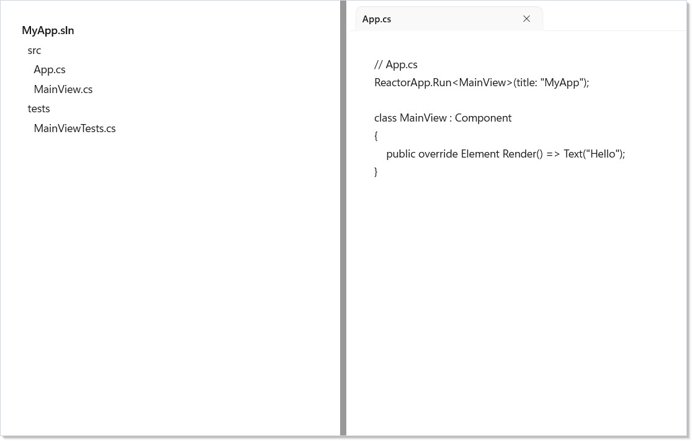
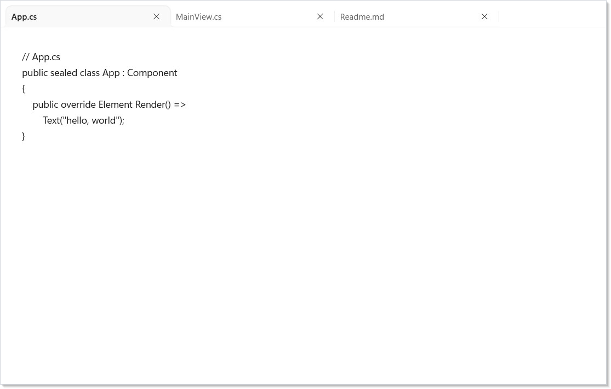
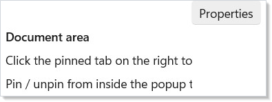
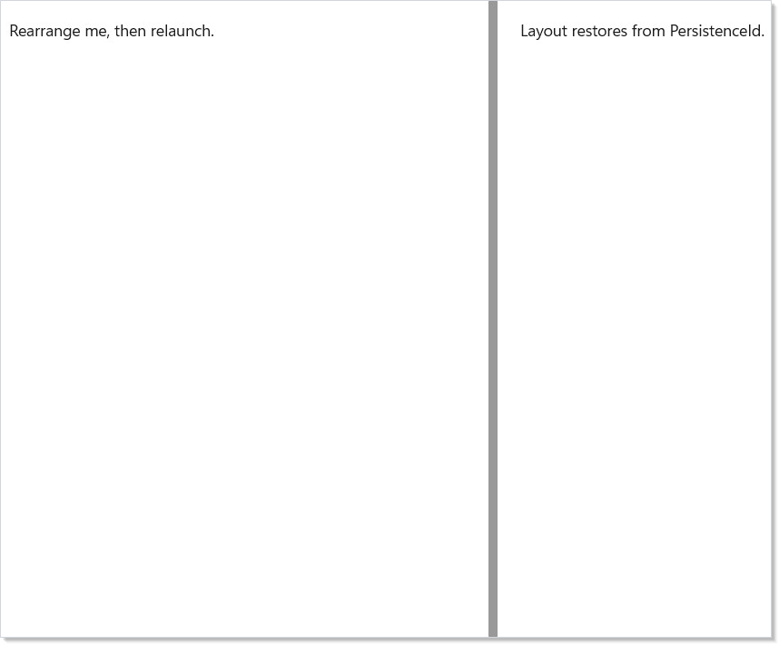

# Docking Windows

Microsoft.UI.Reactor's docking system lets a single shell host multiple
user-rearrangeable surfaces — the Visual Studio / VS Code / Photoshop /
Figma layout idiom. Users drag tabs between groups, split panes, pin
tool windows to a side, and tear panes out into floating sub-windows;
layouts persist across sessions.

The element is `DockManager`. Its `Layout` is an immutable `DockNode`
tree describing the desired arrangement; the reconciler turns that
tree into native WinUI controls and applies the minimum mutations on
every re-render.

## Minimal Setup

Docking is an opt-in element type — register it at host construction
time, then use `DockManager` like any other Reactor element:

```csharp
ReactorApp.Run<DockingApp>(
    title: "Docking",
    width: 900,
    height: 600,
    configure: host => DockingNativeInterop.Register(host.Reconciler));
```

`DockingNativeInterop.Register` wires the `DockManager`, splitter, and
drop-target elements into the reconciler. Without it, a `DockManager`
in your tree will not be recognized.

A two-pane horizontal split:

```csharp
class TwoPaneDemo : Component
{
    public override Element Render() => new DockManager
    {
        Layout = new DockSplit(
            Orientation.Horizontal,
            new DockNode[]
            {
                new ToolWindow
                {
                    Title = "Solution Explorer",
                    Key = "tool:solution",
                    Width = 260,
                    Content = VStack(6,
                        TextBlock("MyApp.sln").SemiBold(),
                        TextBlock("  src"),
                        TextBlock("    App.cs"),
                        TextBlock("    MainView.cs"),
                        TextBlock("  tests"),
                        TextBlock("    MainViewTests.cs")
                    ).Padding(12)
                },

                new DockTabGroup(
                    Documents: new DockableContent[]
                    {
                        new Document
                        {
                            Title = "App.cs",
                            Key = "doc:app-cs",
                            Content = VStack(4,
                                TextBlock("// App.cs"),
                                TextBlock("ReactorApp.Run<MainView>(title: \"MyApp\");"),
                                TextBlock(""),
                                TextBlock("class MainView : Component"),
                                TextBlock("{"),
                                TextBlock("    public override Element Render() => Text(\"Hello\");"),
                                TextBlock("}")
                            ).Padding(16)
                        }
                    },
                    SelectedIndex: 0),
            }),
    };
}
```



The leaves of the tree are pane records. Prefer `Document` for closable
editor-like panes and `ToolWindow` for hideable, side-pinnable tools; both
derive from the source-compatible `DockableContent` base. Each pane carries
a `Title` (shown on the tab / floating window), an optional `Content`
element subtree, and — importantly — a stable `Key`.

**`Key` is required for any pane whose state should survive
reorderings, tab moves, and tear-outs.** Reactor's keyed reconciler
matches panes by `Key` and preserves the element subtree (and its
`UseState` slots) across tree rebuilds. There is no implicit
`Title`-as-key fallback; always supply one.

The `DockNode` algebra has three node kinds (all immutable records):

| Type | Purpose |
|------|---------|
| `DockSplit(Orientation, Children, …)` | Splits children along one axis, with drag-resize splitters between them |
| `DockTabGroup(Documents, TabPosition, CompactTabs, …)` | Presents children as tabs |
| `Document` | Closable leaf pane for editor/document surfaces; cannot pin by default |
| `ToolWindow` | Hideable leaf pane for tool surfaces; can auto-hide/pin by default |
| `DockableContent` | Base leaf pane kept for older positional-constructor code |

`DockManager` itself accepts these props:

| Prop | Purpose |
|------|---------|
| `Layout` | Root of the `DockNode` tree |
| `LeftSide` / `TopSide` / `RightSide` / `BottomSide` | Pinned tool windows along an edge |
| `ActiveDocument` | Resolves by `Key` against `Layout`; mismatched keys leave activation alone |
| `Adapter` | `IDockAdapter` for rehydration and floating chrome |
| `PersistenceId` | Routes layout JSON through `WindowPersistedScope` |
| `LayoutStrategy` | Routes programmatic document/tool inserts before default placement |
| `OnLayoutChanging` / `OnLayoutChanged` and pane lifecycle events | Observe or cancel layout, close, hide, float, and dock transitions |
| `ShowDropTargets` | Shows the drop-target overlay for drag, keyboard, or test-driven moves |
| `SplitRatios` / `OperationLog` | Optional diagnostics and externally-owned split sizing |

## Tab Groups

`DockTabGroup` holds N `DockableContent` leaves and presents them as
tabs. Users reorder by drag; `SelectedIndex` reports the active tab:

```csharp
class TabGroupDemo : Component
{
    public override Element Render() => new DockManager
    {
        Layout = new DockTabGroup(
            Documents: new[]
            {
                new Document
                {
                    Title = "App.cs",
                    Key = "doc:app",
                    Content = VStack(4,
                        TextBlock("// App.cs"),
                        TextBlock("public sealed class App : Component"),
                        TextBlock("{"),
                        TextBlock("    public override Element Render() =>"),
                        TextBlock("        Text(\"hello, world\");"),
                        TextBlock("}")
                    ).Padding(16)
                },
                new Document
                {
                    Title = "MainView.cs",
                    Key = "doc:main",
                    Content = TextBlock("// MainView.cs body").Padding(16)
                },
                new Document
                {
                    Title = "Readme.md",
                    Key = "doc:readme",
                    Content = TextBlock("# Readme").Padding(16)
                },
            },
            SelectedIndex: 0),
    };
}
```



`TabPosition.Bottom` combined with `CompactTabs: true` produces
Office's tool-pane shape. `Document` panes are closeable by default; a
closed document raises the document lifecycle callbacks and is removed
from the native layout.

## Shaping a Document Well

Set `Role` on a `DockTabGroup` to declare the IDE-class document-vs-tool
distinction. Three values:

- `DockGroupRole.General` — the default; accepts every category and
  culls when emptied. Pre-spec-046 behavior.
- `DockGroupRole.DocumentArea` — the document well. Preferred target
  for `Dock(Center)` on `Document` panes; rejects `ToolWindow` drops by
  default. Survives empty (no per-group `ShowWhenEmpty` needed) so the
  well stays a visible drop target after the last document closes.
- `DockGroupRole.ToolWindowStrip` — an edge strip of tool windows.
  Preferred target for `ToolWindow` panes; rejects `Document` drops.

A Visual-Studio-shaped layout: tool strip on the left, document well in
the middle, tool strip on the right. `model.Dock(doc, DockTarget.Center)`
lands in the middle group regardless of where it sits in tree order:

```csharp
new DockSplit(Orientation.Horizontal, new DockNode[]
{
    new DockTabGroup(
        new[] { galleryItemsToolWindow },
        Width: 260,
        Role: DockGroupRole.ToolWindowStrip),
    new DockTabGroup(
        Array.Empty<DockableContent>(),
        Role: DockGroupRole.DocumentArea), // implies ShowWhenEmpty
    new DockTabGroup(
        new[] { configurationToolWindow },
        Width: 320,
        Role: DockGroupRole.ToolWindowStrip),
})
```

> Programmatic `Dock(content, DockTarget.Center)` routes to the first
> `DockGroupRole.DocumentArea` group, falling back to the first compatible
> group (and logging a diagnostic if none accepts the payload). To target
> a specific group regardless of role, use the
> `Dock(content, DockTabGroup, DockTarget)` overload — the explicit
> placement is trusted and skips the role compatibility check.

When the user splits a `Document` inside a `DocumentArea` via drag, the
new sibling group inherits the role — splitting a doc well produces two
doc wells, not one well plus a `General` group. The same propagation
fires for `ToolWindowStrip` when the user drops a tool on the layout's
edge: `DockBottom` with a `ToolWindow` payload creates a new
`ToolWindowStrip`-roled group at the bottom, even when no strip existed
before.

## Constraining Tool Window Placement

`ToolWindow.AllowedSides` is a `[Flags]` mask that limits which edges a
tool window may dock to (Qt's `setAllowedAreas` shape). Default
`DockSides.All` preserves unconstrained placement. Set it to
`DockSides.Bottom` to lock an Errors pane to the bottom strip:

```csharp
var errors = new ToolWindow {
    Title = "Errors",
    Key = "tool:errors",
    AllowedSides = DockSides.Bottom,
};
```

Effect:

- The drop-target overlay dims edges the mask excludes during drag, and
  the hit-test ignores those targets — releasing over a forbidden edge
  snaps the pane back.
- `model.PinToSide(tw, DockSide.Left)` throws
  `InvalidOperationException` when `Left` isn't in the mask. Strategies
  that need to bypass should clone via `tw with { AllowedSides =
  DockSides.All }` before calling.
- `DockSides.None` is allowed and means the tool window is float-only —
  every `PinToSide` throws and every dock-edge target dims during drag.

## Side Pins (Auto-Hide)

`LeftSide`, `TopSide`, `RightSide`, and `BottomSide` on `DockManager`
carry pinned tool windows. Each collapses to an edge icon; clicking
the icon expands a popup, clicking out collapses it back:

```csharp
class SidePinDemo : Component
{
    public override Element Render() => new DockManager
    {
        Layout = new Document
        {
            Title = "Document",
            Key = "doc:main",
            Content = VStack(8,
                TextBlock("Document area").SemiBold(),
                TextBlock("Click the pinned tab on the right to expand it."),
                TextBlock("Pin / unpin from inside the popup to toggle.")
            ).Padding(16)
        },

        RightSide = new[]
        {
            new ToolWindow
            {
                Title = "Properties",
                Key = "tool:properties",
                Content = VStack(4,
                    TextBlock("Name").SemiBold(),
                    TextBlock("Width: 240"),
                    TextBlock("Height: 120")
                ).Padding(12)
            },
        },
    };
}
```



Use `ToolWindow` for side-pin content. It enables pin and auto-hide
affordances by default, so users can pin and unpin at runtime, and the
moved-to-side state round-trips through persistence.

## Persistence

Set `PersistenceId` to enable automatic save/restore. Reactor routes
the layout JSON through `WindowPersistedScope["docking:<id>"]` so the
arrangement survives app restarts:

```csharp
class PersistenceDemo : Component
{
    public override Element Render() => new DockManager
    {
        // Layout JSON is auto-saved to WindowPersistedScope["docking:my-shell"].
        // It is the restore fallback when a later mount leaves Layout null.
        PersistenceId = "my-shell",
        Layout = new DockSplit(
            Orientation.Horizontal,
            new DockNode[]
            {
                new ToolWindow
                {
                    Title = "Outline",
                    Key = "tool:outline",
                    Width = 240,
                    Content = TextBlock("Rearrange me, then relaunch.").Padding(12)
                },
                new Document
                {
                    Title = "Editor",
                    Key = "doc:editor",
                    Content = TextBlock("Layout restores from PersistenceId when no declarative Layout is supplied.").Padding(12)
                },
            }),
    };
}
```



The declarative `Layout` remains the source of truth while you provide
one. Persisted JSON is used as the restore fallback when a later mount
sets the same `PersistenceId` and leaves `Layout` null. Re-render with a
different `PersistenceId` to start fresh.

## Floating Tear-Outs

When a user drags a tab title into open space, a floating window
appears at the pointer with a custom title bar supplied by an
`IDockAdapter`:

```csharp
class FloatingChromeAdapter : IDockAdapter
{
    public Element? OnContentCreated(DockableContent content) => null;
    public void OnGroupCreated(DockTabGroupContext group) { }

    // Custom title bar painted on torn-out floating windows.
    public Element? GetFloatingWindowTitleBar(DockableContent? source) =>
        HStack(8,
            TextBlock("📌").Opacity(0.7),
            TextBlock(source?.Title ?? "Floating").SemiBold(),
            TextBlock(" — My App").Opacity(0.5)
        ).Padding(12, 6, 12, 6);
}
```

Pass the adapter on `DockManager.Adapter`. `OnContentCreated` is called
when a pane is rehydrated from persisted JSON — return the Reactor
subtree to mount inside it, keyed off `content.Key`. For observation and
cancellation, prefer the per-event `DockManager` callbacks such as
`OnContentFloating`, `OnContentDocking`, `OnDocumentClosing`, and
`OnLayoutChanged`; the older behavior interface is obsolete.

## Pane Hooks

Pane content can read docking context through hooks:

| Hook | Use |
|------|-----|
| `ctx.UsePane()` | Stable pane identity (`Key`, title, role) for the current subtree |
| `ctx.UseDockState()` | Current pane state: docked, floating, auto-hidden, expanded, or hidden |
| `ctx.UseIsActivePane()` | True only for the active pane |
| `ctx.UseDockPanePersisted(key, initial)` | Window-scoped persisted state automatically prefixed by pane key |

Use `ctx.UseDockLayout()` sparingly — it re-renders on any structural
layout change and is intended for devtools and diagnostics, not ordinary
pane bodies.

## Tips

**Always set `Key` on panes with stateful content.** A controlled
`TextBox` inside a pane without a `Key` will lose its draft text the
moment a user drags the tab — the reconciler can't tell it's the
"same" pane, so it remounts the subtree. Keys can be strings, GUIDs,
enums, or any equatable domain identifier.

**Build the tree from data, not branches.** Mapping a
`List<DocumentVm>` through `.Select(d => new DockableContent(…))` is
the idiomatic way to drive open documents. There is no
`DocumentsSource` binding API; the closure does the work.

**Register once per host.** `DockingNativeInterop.Register` is
idempotent, but the natural place to call it is the `configure:`
callback on `ReactorApp.Run`. Apps that open secondary windows via
`ReactorApp.OpenWindow` should register on each new `ReactorHost`.

**Layouts are immutable records — produce a new tree.** Like any
Reactor element, mutate by re-rendering with a new `DockManager`.
Keyed reconciliation handles the diff; you don't manage the underlying
control yourself.

## Next Steps

- **[Windows](windows.md)** — top-level window lifecycle, the host
  surface that docking lives inside.
- **[Persistence](persistence.md)** — `UsePersisted`, scopes, and the
  `WindowPersistedScope` that docking layouts route through.
- **[Components](components.md)** — `Key` rules and the reconciler
  identity model that `DockableContent.Key` plugs into.
- **[Reactor](index.md)** — back to the docset index.
