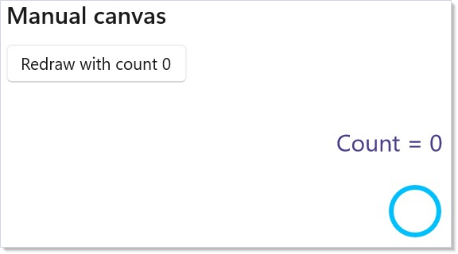
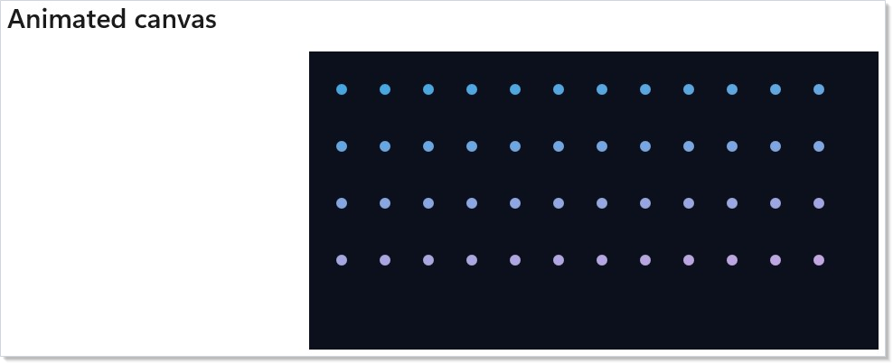
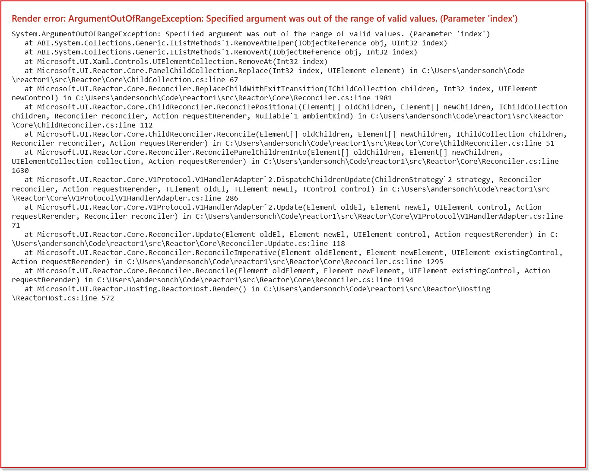

> **WinUI reference:** For the full property surface and design guidance, see [Introduction](https://microsoft.github.io/Win2D/WinUI3/html/Introduction.htm).

Reactor is a retained UI framework: a [component](components.md) renders immutable elements, the reconciler diffs them, and WinUI keeps the controls alive. Win2D is the immediate-mode escape hatch for pixels that are too dynamic or too numerous for retained controls — particle fields, paint surfaces, spectrograms, image editors, and GPU-heavy simulations. `Microsoft.UI.Reactor.Advanced` keeps that power opt-in so simple apps do not carry Win2D's native payload, while the canvas elements still live inside the same [hooks](hooks.md), [effects](effects.md), and reconciliation model as ordinary controls. Think of the canvas as a native WinUI island whose pixels are pulled by Win2D callbacks and whose lifetime, props, and invalidation are driven by Reactor.

# Win2D canvas

`Reactor.Advanced` exposes the three Win2D canvas controls as Reactor elements: <!-- ref:Win2DCanvas -->, <!-- ref:Win2DAnimatedCanvas -->, and <!-- ref:Win2DVirtualCanvas -->. Add the package when you need immediate-mode drawing; keep using ordinary [components](components.md), [Animation](animation.md), and the [Extending Reactor controls](extending-reactor-controls.md) model for retained UI.

## Three canvases, three workloads

| Win2D control | When you use it | Threading | Reactor element |
|---|---|---|---|
| **`CanvasControl`** | One-shot drawings or invalidate-on-data-change scenes: gauges, chart-like visuals, paint tools. | UI-thread `Draw`. | `Win2DCanvas` |
| **`CanvasAnimatedControl`** | Game-loop style: steady `Update(args)` then `Draw(session)` at a target frame rate. | Win2D game thread. | `Win2DAnimatedCanvas` |
| **`CanvasVirtualControl`** | Very large or scrollable surfaces: whiteboards, image editors, multi-megapixel artboards. | UI-thread region draw. | `Win2DVirtualCanvas` |

All three use `CanvasDrawingSession` for drawing. They differ in **who invalidates** and **which thread calls you back**.

## Manual canvas (`Win2DCanvas`)

Use `Win2DCanvas(...)` when pixels should change only after app state changes. Pass every state value the draw callback depends on as `redrawKey`; when the key changes during reconciliation, the handler calls `CanvasControl.Invalidate()`.

```csharp
class ManualCanvasDemo : Component
{
    public override Element Render()
    {
        var (count, setCount) = UseState(0);

        return VStack(12,
            SubHeading("Manual canvas"),
            Button($"Redraw with count {count}", () => setCount(count + 1)),
            Win2DCanvas((session, _) =>
            {
                session.Clear(Colors.White);
                session.DrawText($"Count = {count}", 24, 24, Colors.DarkSlateBlue);
                session.DrawCircle(90, 96, 20 + count * 3, Colors.DeepSkyBlue, 4);
            }, redrawKey: count)
                .ClearColor(Colors.White)
                .Width(360)
                .Height(150)
        ).Padding(20);
    }
}
```



`RedrawKey` is intentionally explicit. It prevents hidden redraw loops and makes the retained-to-immediate boundary visible in code: state changes re-render the element, the key changes, and the next canvas frame uses the new captured state.

> **Caveat:** `Win2DCanvas` does **not** redraw for arbitrary mutation that Reactor cannot see. If `OnDraw` reads a mutable field, a timer, or data updated outside a hook setter, you must either include a changing `RedrawKey` in the element or invalidate through a deliberate control ref / command path. For ordinary Reactor state, prefer making the state value (or a version number derived from it) the key.

## Animated canvas (`Win2DAnimatedCanvas`)

Use `Win2DAnimatedCanvas(...)` for steady-tick scenes. The draw loop runs independently of Reactor re-renders, but the state object you pass through `drawState` survives renders because it comes from `UseDrawState`.

```csharp
class AnimatedCanvasDemo : Component
{
    public override Element Render()
    {
        return Memo(ctx =>
        {
            var dots = ctx.UseDrawState(() => DotField.Create(count: 180, width: 420, height: 220));
            var sprite = ctx.UseCanvasResources<CanvasBitmap>(device =>
            {
                byte[] pixels =
                [
                    0x00, 0x78, 0xD4, 0xFF,
                    0x50, 0xC8, 0x78, 0xFF,
                    0xFF, 0xB9, 0x00, 0xFF,
                    0xD8, 0x3B, 0x01, 0xFF,
                ];

                var bitmap = CanvasBitmap.CreateFromBytes(
                    device,
                    pixels,
                    widthInPixels: 2,
                    heightInPixels: 2,
                    Windows.Graphics.DirectX.DirectXPixelFormat.B8G8R8A8UIntNormalized);
                return ValueTask.FromResult(bitmap);
            });

            return VStack(12,
                SubHeading("Animated canvas"),
                Win2DAnimatedCanvas(
                    onUpdate: (args, state) => ((DotField)state!).Step(args.Timing.ElapsedTime),
                    onDraw: (session, _, state) =>
                    {
                        var field = (DotField)state!;
                        session.Clear(Color.FromArgb(255, 12, 16, 28));
                        field.Draw(session);

                        if (sprite.Current is { } bitmap)
                            session.DrawImage(bitmap, 16, 16, new Rect(0, 0, 2, 2), 0.85f);
                    },
                    drawState: dots.Current)
                    .ClearColor(Color.FromArgb(255, 12, 16, 28))
                    .TargetFps(60)
                    .Width(420)
                    .Height(220)
                    // UseCanvasResources builds the sprite on Win2D's shared device, so the
                    // canvas must draw with that same device — otherwise the cross-device
                    // DrawImage raises a fatal stowed exception.
                    .UseSharedDevice()
            ).Padding(20);
        });
    }
}
```



Read [Threading](#threading) before putting real work in `onUpdate` or `onDraw`. Both callbacks run on the Win2D game thread, so they may read a `UseDrawState` object, but they must not touch WinUI controls. If the loop needs to report state back to Reactor chrome, use a thread-safe hook setter or a lock-free buffer that the UI reads later.

## Virtual canvas (`Win2DVirtualCanvas`)

Use `Win2DVirtualCanvas(...)` when the logical content is much larger than the viewport. Win2D asks you to draw invalidated regions; Reactor exposes `InvalidateRegions` as an immutable command prop. Pass a **new** list instance to invalidate specific tiles after a state change.

```csharp
class VirtualCanvasDemo : Component
{
    public override Element Render()
    {
        var (stamp, setStamp) = UseState(0);
        var highlightedTile = new Rect(1024, 512, 360, 360);

        var canvas = Win2DVirtualCanvas((session, region) =>
        {
            const double tile = 512;
            session.Clear(Colors.WhiteSmoke);

            for (double y = Math.Floor(region.Y / tile) * tile; y < region.Y + region.Height; y += tile)
            {
                for (double x = Math.Floor(region.X / tile) * tile; x < region.X + region.Width; x += tile)
                {
                    var rect = new Rect(x, y, tile, tile);
                    var color = ((int)(x / tile + y / tile) % 2) == 0
                        ? Color.FromArgb(255, 232, 244, 255)
                        : Color.FromArgb(255, 245, 235, 255);
                    session.FillRectangle(rect, color);
                    session.DrawRectangle(rect, Colors.SlateGray, 2);
                    session.DrawText($"tile {x / tile:0},{y / tile:0}", (float)x + 24, (float)y + 28, Colors.DarkSlateGray);
                }
            }

            session.FillRectangle(new Rect(0, 0, 420, 260), Color.FromArgb(255, 0, 120, 212));
            session.DrawText("origin tile", 32, 32, Colors.White);
            session.FillRectangle(highlightedTile, Color.FromArgb(255, 255, 185, 0));
            session.DrawText($"invalidated {stamp}", 1052, 560, Colors.Black);
        }, new Size(4000, 4000)) with
        {
            InvalidateRegions = stamp == 0 ? null : [highlightedTile]
        };

        return VStack(12,
            SubHeading("Virtual canvas"),
            Button("Invalidate highlighted tile", () => setStamp(stamp + 1)),
            ScrollView(canvas)
                .Width(620)
                .Height(320)
        ).Padding(20);
    }
}
```



Keep tile math deterministic. Region callbacks can arrive in any visible tile order, so derive the tile background and labels from coordinates rather than from mutable iteration state.

## Hooks

| Hook | Purpose | Typical canvas |
|---|---|---|
| `UseDrawState<T>(Func<T>)` | Stable mutable frame state that survives component re-renders. | Animated, manual hot paths |
| `UseCanvasResources<T>(create, dispose?)` | Device-loss-safe resource acquisition and cleanup. | Any canvas with bitmaps, geometries, render targets |
| `UseDrawCommand<TState>(state, draw, deps)` | Memoized draw delegate for manual canvases. | Manual |

### `UseDrawState`

`UseDrawState` is a discoverable `UseRef` shape for frame-owned state. The object in `Current` is the one passed as `drawState`, so animated callbacks keep their particle arrays or physics buffers while Reactor re-renders the surrounding controls.

```csharp
class AnimatedCanvasDemo : Component
{
    public override Element Render()
    {
        return Memo(ctx =>
        {
            var dots = ctx.UseDrawState(() => DotField.Create(count: 180, width: 420, height: 220));
            var sprite = ctx.UseCanvasResources<CanvasBitmap>(device =>
            {
                byte[] pixels =
                [
                    0x00, 0x78, 0xD4, 0xFF,
                    0x50, 0xC8, 0x78, 0xFF,
                    0xFF, 0xB9, 0x00, 0xFF,
                    0xD8, 0x3B, 0x01, 0xFF,
                ];

                var bitmap = CanvasBitmap.CreateFromBytes(
                    device,
                    pixels,
                    widthInPixels: 2,
                    heightInPixels: 2,
                    Windows.Graphics.DirectX.DirectXPixelFormat.B8G8R8A8UIntNormalized);
                return ValueTask.FromResult(bitmap);
            });

            return VStack(12,
                SubHeading("Animated canvas"),
                Win2DAnimatedCanvas(
                    onUpdate: (args, state) => ((DotField)state!).Step(args.Timing.ElapsedTime),
                    onDraw: (session, _, state) =>
                    {
                        var field = (DotField)state!;
                        session.Clear(Color.FromArgb(255, 12, 16, 28));
                        field.Draw(session);

                        if (sprite.Current is { } bitmap)
                            session.DrawImage(bitmap, 16, 16, new Rect(0, 0, 2, 2), 0.85f);
                    },
                    drawState: dots.Current)
                    .ClearColor(Color.FromArgb(255, 12, 16, 28))
                    .TargetFps(60)
                    .Width(420)
                    .Height(220)
                    // UseCanvasResources builds the sprite on Win2D's shared device, so the
                    // canvas must draw with that same device — otherwise the cross-device
                    // DrawImage raises a fatal stowed exception.
                    .UseSharedDevice()
            ).Padding(20);
        });
    }
}
```

### `UseCanvasResources`

`UseCanvasResources` creates device-backed resources, re-runs the factory after `CanvasDevice.DeviceLost`, and disposes the old resources on unmount. The same snippet loads a tiny `CanvasBitmap` and draws it in the animated canvas.

```csharp
var sprite = ctx.UseCanvasResources<CanvasBitmap>(device =>
{
    byte[] pixels =
    [
        0x00, 0x78, 0xD4, 0xFF,
        0x50, 0xC8, 0x78, 0xFF,
        0xFF, 0xB9, 0x00, 0xFF,
        0xD8, 0x3B, 0x01, 0xFF,
    ];

    var bitmap = CanvasBitmap.CreateFromBytes(
        device,
        pixels,
        widthInPixels: 2,
        heightInPixels: 2,
        Windows.Graphics.DirectX.DirectXPixelFormat.B8G8R8A8UIntNormalized);
    return ValueTask.FromResult(bitmap);
});
```

> **Shared device required.** `UseCanvasResources` builds resources on Win2D's process-wide shared device. Any canvas that draws those resources must opt into the same device with `.UseSharedDevice()` — see [Shared device](#shared-device).

### Shared device

Win2D resources (bitmaps, geometries, render targets) are **device-affine**: a resource created on one `CanvasDevice` can only be drawn by a drawing session from that same device. By default each canvas control owns a *dedicated* device, while `UseCanvasResources` builds resources on the *shared* device returned by `CanvasDevice.GetSharedDevice()`. Drawing a shared-device resource with a control that owns a different device raises a cross-device error that surfaces as a **fatal stowed exception** (the app crashes, not throws).

Opt the canvas into the shared device with the declarative `.UseSharedDevice()` modifier whenever it draws `UseCanvasResources` output (or any resource built from `CanvasDevice.GetSharedDevice()`):

```csharp
Win2DAnimatedCanvas(onUpdate: ..., onDraw: ..., drawState: dots.Current)
    .TargetFps(60)
    .UseSharedDevice();
```

The modifier is available on all three canvas elements (`Win2DCanvas`, `Win2DAnimatedCanvas`, `Win2DVirtualCanvas`). Resources created and drawn entirely within a single canvas's own `OnCreateResources` (using that control's device) do not need it.

#### Choosing between `UseCanvasResources` and `OnCreateResources`

Both create device-backed resources with device-loss recovery; they differ in *which* device owns the resource:

| | `UseCanvasResources` hook | Canvas `OnCreateResources` callback |
|---|---|---|
| Device | Win2D's process-wide **shared** device | The **canvas's own** device (`ctrl.Device`) |
| Requires `.UseSharedDevice()` | Yes, on every canvas that draws the resource | No |
| Reuse across multiple canvases | Yes — one hook, many canvases | No — per canvas |
| Resource lifetime | Owned by the hook (ref + auto-dispose on unmount) | You store/dispose it yourself |
| Best for | Sprites/atlases shared by several canvases, or component-level resource state | A resource only one canvas draws |

The `create` callback you pass to `UseCanvasResources` already receives the `CanvasDevice` to build on — the hook deliberately supplies the *shared* device so a single resource can feed any number of canvases. Passing a canvas's own device into the hook instead is not supported: the control creates its device lazily (it is usually not realized when the hook's effect runs) and replaces it on device loss, so there is no stable per-canvas device to hand the hook. When you want a resource bound to one canvas's device, create it in that canvas's `OnCreateResources` — Win2D re-raises the callback with the fresh device after a loss:

```csharp
Win2DAnimatedCanvas(
    onUpdate: ...,
    onDraw: (session, _, _) => { if (_sprite is { } s) session.DrawImage(s); }) with
{
    OnCreateResources = async ctrl => _sprite = await CanvasBitmap.LoadAsync(ctrl.Device, spriteUri)
};
```

### `UseDrawCommand`

`UseDrawCommand` is the Win2D equivalent of `UseCallback`: memoize a manual draw delegate when rebuilding the delegate would allocate or capture too much on every render.

```csharp
var draw = UseDrawCommand(
    state: count,
    draw: static (session, _, value) =>
        session.DrawText($"Count = {value}", 16, 16, Colors.Black),
    deps: [count]);

return Win2DCanvas(draw, redrawKey: count);
```

## Threading

| Callback | Thread |
|---|---|
| `Win2DCanvas.OnDraw` | UI thread. Touching Reactor state from inside is safe. |
| `Win2DCanvas.OnCreateResources` | Worker thread managed by Win2D. |
| `Win2DAnimatedCanvas.OnUpdate` / `.OnDraw` | **Win2D game thread.** Reading hook state via `Ref<T>.Current` is safe only when `T` is safe for that access pattern. Touching WinUI controls is not safe. |
| `Win2DAnimatedCanvas.OnCreateResources` | Game thread before the loop starts. |
| `Win2DVirtualCanvas.OnRegionDraw` | UI thread. |
| `UseCanvasResources` `create` | Worker or game thread depending on the host canvas. |

Treat `Ref<T>` as a stable, non-volatile slot: writes from the UI thread are eventually visible to the Win2D game thread, but `Ref<T>` itself inserts no memory barriers and does not protect compound mutations. Make the referenced object thread-safe (lock, `Interlocked`, `Volatile`, or a producer/consumer queue drained at the start of the next tick) when both threads can mutate it. Reactor does not marshal animated callbacks to the UI thread because the point of `CanvasAnimatedControl` is to avoid the UI-thread bottleneck. See `UseDrawState`'s XML remarks for the per-shape guidance.

> **Debug sentinel:** debug builds wrap animated `OnUpdate` / `OnDraw` and append a pointer to this section when a likely WinUI thread-affinity exception escapes. The sentinel is a diagnostic aid, not a synchronization model.

## Device loss

A `CanvasDevice` can be lost when the GPU resets, a monitor changes, or a driver updates. Resources tied to the old device must be recreated on the replacement device. `UseCanvasResources` owns that loop: dispose the old resource, call your `create(CanvasDevice)` factory again, and leave a fresh value in the returned ref. Resources allocated ad hoc inside `OnDraw` are your responsibility and are also a performance smell.

## Performance: Particle Storm

The [Particle Storm sample](../../samples/apps/particle-storm/) is the canonical worked example for `Reactor.Advanced`: `Win2DAnimatedCanvas` for the hot path, pure Reactor controls for the chrome (sliders, palette choices, pause/resume, live FPS), and a producer/consumer queue for cross-thread mutations from the UI thread into the game-thread simulation. Run the sample and capture FPS at your particle-count targets on your own hardware; the sample's README documents the baseline-measurement methodology.

## Tips

- Pick the canvas by workload first: data-change redraw, steady loop, or tiled surface.
- Prefer `UseCanvasResources` for `CanvasBitmap`, `CanvasGeometry`, render targets, and sprite sheets; do not recreate them in `OnDraw`.
- Use Win2D batching APIs such as `CanvasSpriteBatch` when drawing tens of thousands of sprites.
- Keep retained Reactor UI around the canvas for controls, layout, [effects](effects.md), and app state.

## Patterns

- **Manual invalidate pattern.** Derive a `RedrawKey` from every value the manual scene reads, and let reconciliation schedule exactly one invalidate.
- **Reactive game-loop pattern.** Store particle/physics buffers in `UseDrawState`; drive parameters from [hooks](hooks.md) and let `OnUpdate` read the latest values on the next tick.
- **Device-loss-safe resource pattern.** Acquire bitmaps and render targets through `UseCanvasResources`, draw only when the ref is non-null, and dispose custom resources in the hook's `dispose` callback when needed. Add `.UseSharedDevice()` to the canvas that draws them (see [Shared device](#shared-device)).
- **Virtual tile pattern.** Use coordinate-derived drawing and pass a new `InvalidateRegions` list for changed tiles.

## Common Mistakes

- Touching WinUI controls from `Win2DAnimatedCanvas.OnUpdate` or `.OnDraw`; use thread-safe state handoff instead.
- Missing `RedrawKey` for value-driven manual scenes, which leaves stale pixels until a resize or DPI change.
- Allocating bitmaps, brushes, arrays, or strings per frame in `OnDraw` instead of reusing draw state and resources.
- Passing the same `InvalidateRegions` list instance after mutating it; Reactor keys invalidation by reference change.
- Drawing `UseCanvasResources` output (or any `CanvasDevice.GetSharedDevice()` resource) on a canvas that has not opted into `.UseSharedDevice()`; the cross-device draw crashes the app with a stowed exception. See [Shared device](#shared-device).

## Next Steps

- Read [Advanced Patterns](advanced.md) for general escape-hatch discipline.
- Review [Extending Reactor controls](extending-reactor-controls.md) to understand how optional controls plug into the V1 handler model.
- Use [Threading and Dispatch](threading-and-dispatch.md) when a game-loop callback needs to hand data back to UI state.
- Explore the [Particle Storm sample](../../samples/apps/particle-storm/) for a full 50k-particle app.
- Compare Win2D's immediate-mode work with retained [Animation](animation.md) and [Charting](charting.md) before choosing the heavy dependency.
