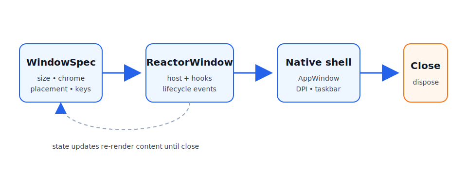

> **WinUI reference:** For the full property surface and design guidance, see [Windowing Overview](https://learn.microsoft.com/en-us/windows/apps/windows-app-sdk/windowing/windowing-overview).

# Windows

Most Microsoft.UI.Reactor (Reactor) apps start with the single window created by
`ReactorApp.Run`. Larger desktop apps can open multiple native WinUI top-level
windows with `WindowSpec` and `ReactorApp.OpenWindow`, while keeping the same
declarative component model used inside a page.



## Lifecycle basics

`ReactorApp.Run<TRoot>(...)` opens the primary window. `ReactorApp.OpenWindow`
opens a secondary window from the UI thread and returns a `ReactorWindow` handle
for imperative lifecycle operations.

```csharp
ReactorApp.Run<WindowsApp>("Windows Demo", width: 640, height: 520
);
```

```csharp
var settings = ReactorApp.OpenWindow(
    new WindowSpec { Title = "Settings", Width = 520, Height = 420 },
    () => new SettingsWindow());

settings.Activate();
settings.Close();
```

Caveats:

- `Close`, `Show`, `Hide`, `Activate`, `Update`, and mutators are UI-thread only.
- `ReactorApp.PrimaryWindow` is the first opened window; shutdown policy decides
  whether closing it exits the process.
- `UseWindow()` returns the owning `ReactorWindow` inside a window component and
  `null` outside one (for example tray flyouts).

## Sizing & resizing

Initial `Width` / `Height` are DIPs. Runtime size is controlled by `SetSize`,
chrome resize policy by `ResizeMode`, interactive aspect locks by `AspectRatio`,
and content-driven sizing by `SizeToContent`.

```csharp
new WindowSpec
{
    Title = "Preview",
    Width = 640,
    Height = 360,
    ResizeMode = WindowResizeMode.CanMinimize,
    AspectRatio = 16.0 / 9.0,
};

window.SetAspectRatio(4.0 / 3.0);
UseWindowAspectRatio(1.0); // lifetime-bound hook; unmount clears it
```

| API | Values / behavior |
| --- | --- |
| `ResizeMode` | `CanResize`, `NoResize`, `CanMinimize` |
| `AspectRatio` | `double?` width / height; honored during drag resize |
| `SizeToContent` | `Manual`, `Width`, `Height`, `WidthAndHeight` |

Caveats:

- `AspectRatio` rejects `ResizeMode.NoResize`; no drag means no constraint to apply.
- `AspectRatio` and `SizeToContent` are mutually exclusive layout drivers.
- `SizeToContent` runs after layout, so the first frame can briefly use the
  initial `Width` / `Height`; maximized windows ignore it and log a warning.
- Min/max fields (`MinWidth`, `MaxHeight`, etc.) win over content and aspect sizing.

## Movement & placement

Use `StartPosition` for initial placement, `SetPosition` for imperative moves,
`Position` for read-back, and `PositionChanged` / `UseWindowPosition()` to react
to live moves.

```csharp
var spec = new WindowSpec
{
    Title = "Command Palette",
    StartPosition = WindowStartPosition.CenterOnCurrent,
    IsMovableByBackground = true,
};

var (x, y) = UseWindowPosition();
var drag = UseWindowDragMove();
Button("Drag window", drag);
```

`IsMovableByBackground` starts the OS move loop when a non-interactive part of
the root is pressed. Mark custom interactive regions with `.Drag(false)`:

```csharp
HStack(
    TextBlock("Palette"),
    Button("Settings").Drag(false));
```

Placement options:

| `WindowStartPosition` | Meaning |
| --- | --- |
| `Default` | WinUI / shell chooses placement |
| `CenterOnPrimary` | Center on primary monitor |
| `CenterOnOwner` | Center on the owner window's monitor |
| `CenterOnCurrent` | Center on the cursor monitor |
| `Manual` | Use `ManualPosition` DIP top-left |

Persistence is opt-in and explicit:

```csharp
var spec = new WindowSpec { Title = "Shell" }
    .WithPersistence("main-window", fallback: WindowStartPosition.CenterOnCurrent);

window.SavePlacement(); // manual best-effort flush
```

Caveats:

- Position values are DIPs; mixed-DPI desktops have no single global DIP grid.
- `PositionChanged` fires eagerly during drags; debounce in app code if needed.
- `PersistenceId` alone is only identity. Placement restore/save requires
  `PersistPlacement = true` or `.WithPersistence(...)`.

## Z-order & visibility

`WindowLevel` selects a z-order tier. `ShowInTaskbar` and `ShowInSwitcher` are
separate because the taskbar button and Alt-Tab visibility are separate shell
concepts.

```csharp
new WindowSpec
{
    Title = "Palette",
    Level = WindowLevel.Floating,
    ShowInTaskbar = false,
    ShowInSwitcher = true,
};

var isCovered = UseIsCovered(); // hint from ZOrderChanged
```

| `WindowLevel` | Behavior |
| --- | --- |
| `Normal` | Regular z-order |
| `Floating` | Stays above owner and other Reactor app windows as they activate |
| `AlwaysOnTop` | Win32 topmost tier |

| `ShowInTaskbar` | `ShowInSwitcher` | Result |
| --- | --- | --- |
| `true` | `true` | Normal app window |
| `true` | `false` | Taskbar button, no Alt-Tab entry |
| `false` | `true` | Tool palette shape |
| `false` | `false` | Transient / launcher / overlay shape |

Caveats:

- `ZOrderChanged.IsCovered` is a covered hint based on HWND insertion order, not
  pixel-accurate occlusion.
- `Floating` is app-local. Use `AlwaysOnTop` only when you need global topmost.
- Runtime taskbar visibility flips hide/show the HWND once so the shell refreshes.

## Chrome & appearance

`WindowStyle` controls native chrome. `WindowCornerStyle` maps to the Windows 11
DWM corner preference. Backdrops are applied either on `WindowSpec.Backdrop` or
with a root `.Backdrop(...)` modifier.

```csharp
new WindowSpec
{
    Title = "HUD",
    Style = WindowStyle.None,
    IsMovableByBackground = true,
    CornerStyle = WindowCornerStyle.Rounded,
    Backdrop = BackdropChoice.Of(BackdropKind.DesktopAcrylic),
};
```

| API | Values |
| --- | --- |
| `WindowStyle` | `Default`, `None`, `ToolWindow` |
| `WindowCornerStyle` | `Default`, `Square`, `Rounded`, `RoundedSmall` |
| `BackdropKind` | `None`, `Mica`, `MicaAlt`, `DesktopAcrylic`, `AcrylicThin`, `Transparent` |

`TitleBar(...)` is the declarative custom title bar. When `WindowSpec.ExtendsContentIntoTitleBar`
is `null` (the default), mounting a `TitleBar(...)` element automatically sets
`Window.ExtendsContentIntoTitleBar = true`. Explicit `true` or `false` on the
spec wins over inference.

```csharp
VStack(
    TitleBar("My app"),
    TextBlock("Body"));
```

Caveats:

- `WindowStyle.None` without `IsMovableByBackground` can strand the user; Reactor
  warns but does not throw.
- `WindowStyle.ToolWindow` defaults to hidden from the taskbar unless
  `ShowInTaskbar` is explicitly set.
- `WindowCornerStyle` is a Windows 11 DWM preference; Windows 10 ignores it.
- `BackdropKind.Transparent` falls back to no backdrop when the referenced Windows
  App SDK does not expose a transparent backdrop type.

## Taskbar integration

`TaskbarItem` groups all taskbar features while keeping the older shortcuts on
`ReactorWindow` for compatibility.

```csharp
var taskbar = UseWindow()!.TaskbarItem;
taskbar.Description = "Build in progress";
taskbar.Progress.State = TaskbarProgressState.Normal;
taskbar.Progress.Value = 0.42;
taskbar.SetThumbnailToolbar([
    new ThumbnailToolbarButton("pause", WindowIcon.FromPath("pause.ico"), "Pause", () => Pause())
]);
```

Facade members:

- `Progress` — same instance as `ReactorWindow.Progress`.
- `Overlay` — same instance as `ReactorWindow.Overlay`.
- `Description` — forwards to `ITaskbarList3.SetThumbnailTooltip`.
- `SetThumbnailToolbar` / `ClearThumbnailToolbar` — same toolbar pipeline as the
  `ReactorWindow` shortcut methods.

Caveats:

- Shell COM calls are best-effort; Reactor keeps last-set managed state where relevant.
- Thumbnail toolbars support at most seven buttons.
- Overlay icons need HICON-compatible sources; resource URIs are not overlay HICONs.

## Displays

`ReactorDisplay` exposes the current monitor layout in Reactor's DIP-oriented
shape and raises `DisplayLayoutChanged` when Windows reports a layout change.

```csharp
var displays = UseDisplays();
var nearest = ReactorDisplay.NearestTo(window.Position.X, window.Position.Y);
```

`DisplayInfo` contains:

| Property | Meaning |
| --- | --- |
| `Id` | Win32 monitor id (for example `\\.\DISPLAY1`) |
| `IsPrimary` | Primary monitor flag |
| `WorkAreaDip` | Work area in approximate DIPs |
| `BoundsDip` | Full bounds in approximate DIPs |
| `Dpi` | Effective monitor DPI |

Caveats:

- Mixed-DPI virtual-screen X/Y values are approximate because Windows exposes
  physical pixels, not a global DIP coordinate system.
- `ReactorDisplay.Displays` is a snapshot. Use `UseDisplays()` to re-render on changes.
- `NearestTo` accepts DIP coordinates in Reactor's approximate display space.

## Pickers

Picker hooks create WinUI storage pickers and initialize them with the owning
window HWND, so the picker is modal to the correct window without app code doing
HWND interop.

```csharp
async Task OpenAsync()
{
    var file = await UseFilePickerAsync(new FilePickerOptions(
        FileTypeFilter: [".txt", ".md"]));
}

var folder = await UseFolderPickerAsync(new FolderPickerOptions());
```

Caveats:

- Picker hooks must be called on the owning window's UI thread.
- Reactor never accepts arbitrary HWNDs; it always uses `UseWindow().NativeWindow`.
- Tests should inject the picker service rather than opening native dialogs.

## WPF / UWP migration map

| Prior stack concept | Reactor 054 shape | Notes |
| --- | --- | --- |
| WPF `ResizeMode` | `WindowResizeMode` | `CanResizeWithGrip` is intentionally omitted. |
| WPF `SizeToContent` | `WindowSizeToContent` | Same four values. Min/max still win. |
| WPF `Topmost` | `WindowLevel.AlwaysOnTop` | `Floating` adds app-local owner/sibling behavior. |
| WPF `WindowStyle.None` | `WindowStyle.None` | Pair with `IsMovableByBackground`. |
| WPF `WindowStartupLocation.CenterScreen` | `CenterOnCurrent` | Cursor monitor first. |
| WPF manual `Top` / `Left` | `Position`, `SetPosition`, `UseWindowPosition` | DIPs, with mixed-DPI caveats. |
| WPF taskbar visibility | `ShowInTaskbar` | Split from `ShowInSwitcher`. |
| Manual settings persistence | `.WithPersistence(id)` | Opt-in, one line. |
| `TaskbarItemInfo` | `TaskbarItem` | Facade over progress, overlay, description, thumb buttons. |
| UWP/WinUI picker HWND setup | `UseFilePickerAsync` / `UseFolderPickerAsync` | Owning HWND is wired automatically. |

## Finding and enumerating windows

```csharp
ReactorApp.Windows          // IReadOnlyList<ReactorWindow> snapshot
ReactorApp.PrimaryWindow    // first window opened, or null after it closes
ReactorApp.FindWindow(key)  // look up by WindowKey
```

Use `WindowKey` for any window you might want to find again. `UseOpenWindow`
lets a component declaratively own a secondary window's existence; tray icons use
`UseTrayIcon` and close automatically on unmount.

```csharp
class SettingsHost : Component
{
    public override Element Render()
    {
        // While this component is mounted, ensure a settings window keyed
        // to "settings" is open. Re-renders that pass the same WindowKey
        // reuse the same handle; the hook dedupes against the live window
        // registry via FindWindow.
        var settings = UseOpenWindow(
            key: "settings",
            spec: new WindowSpec { Title = "Settings", Width = 480, Height = 360 },
            factory: () => new SettingsWindow());

        return TextBlock(settings is null
            ? "(no UI dispatcher)"
            : $"Settings open — id={settings.Id}");
    }
}
```

## Shutdown policy

```csharp
// Call once at startup, before ReactorApp.Run. With OnLastSurfaceClosed the
// process keeps running while a tray icon or any window is alive; with
// Explicit you must call ReactorApp.Exit() yourself.
static class Startup
{
    public static void ConfigureShutdown()
    {
        ReactorApp.ShutdownPolicy = ShutdownPolicy.OnLastSurfaceClosed;
    }
}
```

| Policy | Process exits when... |
| --- | --- |
| `OnPrimaryWindowClosed` *(default)* | The primary window closes |
| `OnLastSurfaceClosed` | The last window and the last tray icon both close |
| `Explicit` | Never automatically; call `ReactorApp.Exit()` |

## Tips

**Memoize specs.** A stable `WindowSpec` avoids unnecessary chrome updates.

**Keep units in DIPs.** Window size and position APIs use DIPs; shell style bits
and DWM APIs use physical pixels internally.

**Choose the narrowest z-order.** Prefer `Floating` for app palettes; reserve
`AlwaysOnTop` for global overlays.

**Use advanced recipes for rejected primitives.** If you need true layered-window
transparency or arbitrary region corners, see [Advanced Windowing](windowing-advanced.md).

## Next Steps

- **[Advanced Windowing](windowing-advanced.md)** — unsupported / interop-heavy window recipes
- **[Docking Windows](docking.md)** — dock panes, floating document tear-outs, persistence
- **[Persistence](persistence.md)** — persisted scopes beyond window placement
- **[Dialogs and Flyouts](dialogs-and-flyouts.md)** — modal in-window UI
- **[Commanding](commanding.md)** — commands for title bars, tray menus, and window actions
