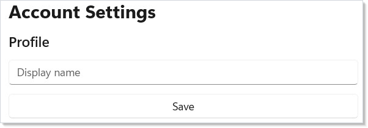
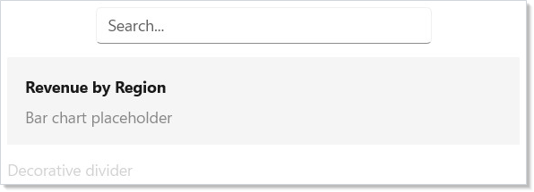
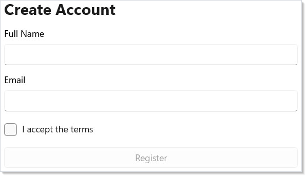
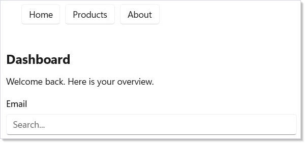

# Accessibility

Duct provides accessibility modifiers on every [component](components.md). They map directly to
WinUI's automation properties, so screen readers, keyboard navigation, and
test tools work out of the box. Modifiers are split into two tiers based on
how often you need them.

## Tier 1 Modifiers

Tier 1 modifiers are the ones you use constantly: labels, headings, tab order,
and keyboard shortcuts. They are applied inline on every render — no lazy
allocation.

```csharp
class Tier1Demo : Component
{
    public override Element Render()
    {
        return VStack(12,
            Text("Account Settings")
                .FontSize(24).Bold()
                .HeadingLevel(AutomationHeadingLevel.Level1),
            Text("Profile")
                .FontSize(18).SemiBold()
                .HeadingLevel(AutomationHeadingLevel.Level2),
            TextField("", _ => { }, placeholder: "Display name")
                .AutomationName("Display name")
                .TabIndex(1)
                .AccessKey("N"),
            Button("Save", () => { })
                .AutomationName("Save profile changes")
                .TabIndex(2)
                .AccessKey("S")
        ).Padding(24);
    }
}
```



Here is what each modifier does:

- **`.HeadingLevel()`** marks an element as a heading (Level1 through Level9).
  Screen reader users navigate by heading, just like `h1`--`h6` in HTML.
- **`.AutomationName()`** sets the accessible label. Use it when the visible
  text does not fully describe the control's purpose.
- **`.TabIndex()`** sets the tab order. Lower values receive focus first.
- **`.AccessKey()`** assigns an Alt+key shortcut. WinUI shows the key hint
  when the user presses Alt.
- **`.IsTabStop()`** controls whether the element participates in Tab
  navigation at all.

## Tier 2 Modifiers

Tier 2 modifiers cover supplemental information, landmarks, and visibility
control. They are lazy-allocated — Duct only creates the backing storage when
you use them, keeping the common case lightweight.

```csharp
class Tier2Demo : Component
{
    public override Element Render()
    {
        return VStack(12,
            TextField("", _ => { }, placeholder: "Search...")
                .AutomationName("Search products")
                .HelpText("Type a product name or SKU to filter results")
                .Width(300),
            VStack(8,
                Text("Revenue by Region").Bold(),
                Text("Bar chart placeholder").Opacity(0.5)
            ).FullDescription(
                "Bar chart showing Q1 revenue: East $4.2M, " +
                "West $3.8M, Central $2.1M")
             .Padding(16).Background("#f5f5f5").CornerRadius(8),
            Text("Decorative divider")
                .Opacity(0.2)
                .AccessibilityHidden()
        ).Padding(24);
    }
}
```



| Modifier | Purpose |
|----------|---------|
| `.HelpText()` | Extra hint read after the name |
| `.FullDescription()` | Extended description for complex visuals |
| `.AccessibilityHidden()` | Hide decorative elements from the tree |
| `.AccessibilityView()` | Content, Control, or Raw visibility |
| `.Landmark()` | Main, Navigation, Search, Form, Custom |
| `.Required()` | Announces "required" for form fields |
| `.LiveRegion()` | Announces dynamic content changes |

The tiered design means you pay zero cost for Tier 2 on elements that only
need a label and heading level.

## Accessible Form

A real [form](forms.md) combines Tier 1 and Tier 2 modifiers. Labels, required markers,
help text, landmarks, and tab order work together:

```csharp
class AccessibleFormDemo : Component
{
    public override Element Render()
    {
        var (name, setName) = UseState("");
        var (email, setEmail) = UseState("");
        var (agree, setAgree) = UseState(false);
        var valid = !string.IsNullOrWhiteSpace(name)
            && email.Contains('@') && agree;

        return VStack(12,
            Text("Create Account").FontSize(24).Bold()
                .HeadingLevel(AutomationHeadingLevel.Level1),
            TextField(name, setName, header: "Full Name")
                .AutomationName("Full name").Required().TabIndex(1),
            TextField(email, setEmail, header: "Email")
                .AutomationName("Email address").Required().TabIndex(2)
                .HelpText("We'll send a verification link"),
            CheckBox(agree, setAgree, label: "I accept the terms")
                .TabIndex(3),
            Button("Register", () => { })
                .Disabled(!valid).TabIndex(4).AccessKey("R")
        ).Landmark(AutomationLandmarkType.Form).Padding(24);
    }
}
```



The form container uses `.Landmark(AutomationLandmarkType.Form)` so screen
reader users can jump directly to it. Each field has `.AutomationName()` for
its label, `.Required()` for required fields, and `.TabIndex()` for
predictable keyboard order. The email field adds `.HelpText()` to explain
what happens after submission.

## Navigation Landmarks

Landmarks let screen reader users jump between major page regions. Use them
on your navigation bar, main content area, and search box:

```csharp
class LandmarksDemo : Component
{
    public override Element Render()
    {
        return VStack(16,
            HStack(8,
                Button("Home", () => { }),
                Button("Products", () => { }),
                Button("About", () => { })
            ).Landmark(AutomationLandmarkType.Navigation)
             .AutomationName("Main navigation"),

            VStack(12,
                Text("Dashboard")
                    .FontSize(20).Bold()
                    .HeadingLevel(AutomationHeadingLevel.Level1),
                Text("Welcome back. Here is your overview.")
            ).Landmark(AutomationLandmarkType.Main)
             .AutomationName("Main content"),

            TextField("", _ => { }, placeholder: "Search...")
                .AutomationName("Site search")
                .Landmark(AutomationLandmarkType.Search)
        ).Padding(24);
    }
}
```



WinUI supports five landmark types: `Navigation`, `Main`, `Search`, `Form`,
and `Custom`. Pair each landmark with `.AutomationName()` so screen readers
announce "Main navigation" rather than just "navigation."

## Heading Hierarchy

A clear heading structure lets screen reader users skim your page. This pairs
well with your [layout](layout.md) hierarchy. Use `Level1` for the page
title, `Level2` for sections, and `Level3` for subsections:

```csharp
class HeadingHierarchyDemo : Component
{
    public override Element Render()
    {
        return VStack(12,
            Text("Application Settings")
                .FontSize(24).Bold()
                .HeadingLevel(AutomationHeadingLevel.Level1),
            Text("Appearance")
                .FontSize(18).SemiBold()
                .HeadingLevel(AutomationHeadingLevel.Level2),
            Text("Choose your preferred theme and font size."),
            Text("Notifications")
                .FontSize(18).SemiBold()
                .HeadingLevel(AutomationHeadingLevel.Level2),
            Text("Email Alerts")
                .FontSize(15).SemiBold()
                .HeadingLevel(AutomationHeadingLevel.Level3),
            Text("Configure which emails you receive.")
        ).Padding(24);
    }
}
```


Keep your heading levels sequential — do not skip from Level1 to Level3.
Screen readers use the hierarchy to build a page outline, and gaps confuse
users.

## Tips

**Label every interactive control.** If the visible text is sufficient, WinUI
infers the name automatically. Use `.AutomationName()` when it is not — icon
buttons, image buttons, and controls with placeholder-only text all need it.

**Use `.Required()` instead of asterisks.** Screen readers announce "required"
automatically. Visual asterisks are invisible to assistive technology unless
you also set the automation property.

**Test with Narrator.** Press Win+Ctrl+Enter to launch Narrator and tab
through your app. Every control should announce its name, role, and state.

**Keep landmarks minimal.** One `Main`, one `Navigation`, and optionally one
`Search` per page. Too many landmarks defeat the purpose — users cannot
quickly jump when every section is a landmark.

**Set `.AccessKey()` on frequent actions.** Alt+S for Save, Alt+N for New.
WinUI renders the key tips automatically when the user presses Alt.

## Next Steps

- **[Context](context.md)** — previous topic: share state across the tree without prop drilling
- **[Localization](localization.md)** — next topic: translate strings, format numbers/dates, and support RTL layouts
- **[Forms and Input](forms.md)** — build accessible forms with labels, validation, and tab order
- **[Navigation](navigation.md)** — add landmarks and keyboard-navigable page structure
- **[Styling and Theming](styling.md)** — ensure high-contrast themes work with your accessible controls
