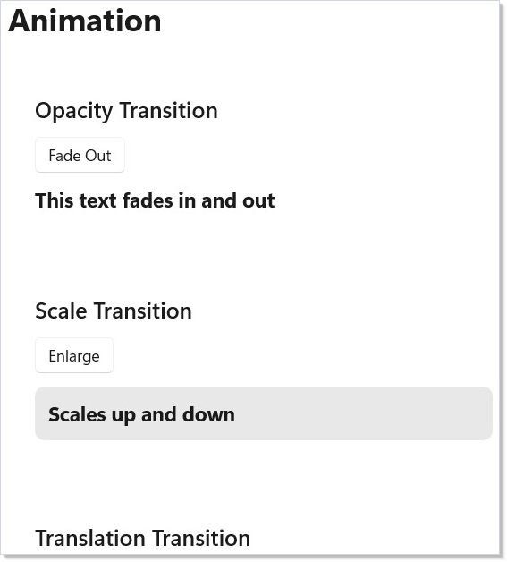

# Animation

Duct animations are declarative. You set the target value (opacity, scale,
translation) and attach a transition modifier. When the value changes on the
next render — driven by [hooks](hooks.md) and state — WinUI animates from
the old value to the new one automatically.

## Opacity Transition

`.OpacityTransition()` animates opacity changes. Set `.Opacity()` to your
target value and the transition handles the rest:

```csharp
class OpacityDemo : Component
{
    public override Element Render()
    {
        var (visible, setVisible) = UseState(true);

        return VStack(12,
            SubHeading("Opacity Transition"),
            Button(visible ? "Fade Out" : "Fade In",
                () => setVisible(!visible)),
            Text("This text fades in and out")
                .FontSize(18).Bold()
                .Opacity(visible ? 1.0 : 0.0)
                .OpacityTransition(TimeSpan.FromMilliseconds(500))
        ).Padding(24);
    }
}
```



The optional `TimeSpan` parameter controls duration. The default is 300ms.
Use this for fade-in/fade-out on showing and hiding elements.

## Scale Transition

`.ScaleTransition()` animates scale changes. Set `.Scale()` to the target
factor:

```csharp
class ScaleDemo : Component
{
    public override Element Render()
    {
        var (enlarged, setEnlarged) = UseState(false);

        return VStack(12,
            SubHeading("Scale Transition"),
            Button(enlarged ? "Shrink" : "Enlarge",
                () => setEnlarged(!enlarged)),
            Border(
                Text("Scales up and down").FontSize(18).Bold()
            ).Padding(12)
             .CornerRadius(8)
             .Background("#e8e8e8")
             .ScaleTransition()
        ).Padding(24);
    }
}
```


Scale uses the element's center as the transform origin. A value of `1.0f` is
normal size, `1.5f` is 150%. You can pass a custom `Vector3Transition` to
control which axes animate.

## Translation Transition

`.TranslationTransition()` animates position offsets. Set `.Translation()`
to the target X, Y, Z offset in pixels:

```csharp
class TranslationDemo : Component
{
    public override Element Render()
    {
        var (moved, setMoved) = UseState(false);

        return VStack(12,
            SubHeading("Translation Transition"),
            Button(moved ? "Slide Back" : "Slide Right",
                () => setMoved(!moved)),
            Text("Slides horizontally")
                .FontSize(18).Bold()
                .Translation(moved ? 120f : 0f, 0f, 0f)
                .TranslationTransition()
        ).Padding(24);
    }
}
```


Translation offsets are relative to the element's layout position. Positive X
moves right, positive Y moves down. The element still occupies its original
layout space — only the visual position changes.

## Background Transition

`.BackgroundTransition()` animates background color changes on `VStack`,
`HStack`, and `Grid` elements:

```csharp
class BackgroundDemo : Component
{
    public override Element Render()
    {
        var (warm, setWarm) = UseState(false);

        return VStack(12,
            SubHeading("Background Transition"),
            Button(warm ? "Cool Colors" : "Warm Colors",
                () => setWarm(!warm)),
            VStack(8,
                Text("Background animates between colors")
                    .Foreground("#ffffff").Bold()
            ).Padding(16)
             .CornerRadius(8)
             .Background(warm ? "#da3b01" : "#0078d4")
             .BackgroundTransition(TimeSpan.FromMilliseconds(600))
        ).Padding(24);
    }
}
```


Background transitions use WinUI's `BrushTransition`. They only work on
panel elements (`StackPanel`, `Grid`) because WinUI restricts
`BackgroundTransition` to those types.

## Combining Transitions

You can chain multiple transition modifiers on a single element. Each
property animates independently:

```csharp
class CombinedDemo : Component
{
    public override Element Render()
    {
        var (active, setActive) = UseState(false);

        return VStack(12,
            SubHeading("Combined Transitions"),
            Button(active ? "Reset" : "Animate",
                () => setActive(!active)),
            Border(
                Text("All at once").FontSize(16).Bold()
                    .Foreground("#ffffff")
            ).Padding(16)
             .CornerRadius(8)
             .Background("#7b2ab5")
             .Opacity(active ? 1.0 : 0.4)
             .Translation(active ? 40f : 0f, 0f, 0f)
             .OpacityTransition(TimeSpan.FromMilliseconds(400))
             .TranslationTransition()
        ).Padding(24);
    }
}
```


Each transition modifier is independent — `.OpacityTransition()` animates
opacity while `.ScaleTransition()` animates scale simultaneously. Set the
target values (`.Opacity()`, `.Scale()`, `.Translation()`) and the
transitions handle the animation for each property in parallel.

## Layout Animation

`.LayoutAnimation()` animates elements when their position changes due to
layout reflow — items entering, leaving, or reordering in a [collection](collections.md):

```csharp
class LayoutAnimationDemo : Component
{
    public override Element Render()
    {
        var (items, updateItems) = UseReducer(
            new List<string> { "Apple", "Banana", "Cherry" });
        var nextId = UseRef(3);

        return VStack(12,
            SubHeading("Layout Animation"),
            HStack(8,
                Button("Add Item", () => {
                    nextId.Current++;
                    updateItems(l => [.. l, $"Item {nextId.Current}"]);
                }),
                Button("Remove Last", () => updateItems(l =>
                    l.Count > 0 ? l.Take(l.Count - 1).ToList() : l))
            ),
            VStack(4, items.Select(item =>
                Text(item).Padding(8, 12).Background("#f0f0f0")
                    .CornerRadius(4).LayoutAnimation()
                    .WithKey($"item-{item}")
            ).ToArray())
        ).Padding(24);
    }
}
```


Layout animation works at the Composition layer. When WinUI repositions an
element (e.g., a sibling is added or removed), Duct animates from the old
position to the new one. Use `.WithKey()` on each element so the reconciler
can track identity across reorders.

You can also use `.LayoutAnimation(TimeSpan)` for a custom duration or
`.SpringLayoutAnimation()` for a bouncy feel.

## Connected Animation

`.ConnectedAnimation(key)` creates a visual continuity effect between two
views. When an element with a key is unmounted and another with the same key
is mounted, WinUI animates a snapshot from the old position to the new one:

```csharp
class ConnectedAnimationDemo : Component
{
    public override Element Render()
    {
        var (selected, setSelected) = UseState<string?>(null);

        if (selected is not null)
            return VStack(12,
                Button("Back to list", () => setSelected(null)),
                Text(selected)
                    .FontSize(28).Bold()
                    .ConnectedAnimation($"title-{selected}")
            ).Padding(24);

        var items = new[] { "Photos", "Music", "Videos" };
        return VStack(12,
            SubHeading("Connected Animation"),
            VStack(4,
                items.Select(item =>
                    Button(item, () => setSelected(item))
                        .ConnectedAnimation($"title-{item}")
                ).ToArray()
            )
        ).Padding(24);
    }
}
```


Both the source and destination elements must use the same key string. The
animation runs automatically when the reconciler detects the transition.
Use connected animations for list-to-detail [navigation](navigation.md)
where an element "flies" from the list into the detail view.

## Tips

**Keep durations short.** 200--400ms feels responsive. Anything over 500ms
feels sluggish. Use the default duration unless you have a specific reason.

**Use `.OpacityTransition()` for show/hide.** It is the lightest transition
and works on every element type. Prefer it over scale or translation for
simple visibility toggles.

**Combine transitions sparingly.** One or two transitions per element is
natural. Three or more competing animations can feel chaotic.

**Always set `.WithKey()` with layout animations.** Without stable keys, the
reconciler cannot track which element moved where, and the animation falls
back to a simple fade.

**Test connected animations with real navigation.** They depend on the
reconciler detecting mount/unmount pairs. If both elements are visible
simultaneously, no animation plays.

## Next Steps

- **[Localization](localization.md)** — previous topic: translate strings, format numbers/dates, and support RTL layouts
- **[Advanced Patterns](advanced.md)** — next topic: error boundaries, memoization, escape hatches, and observable binding
- **[Navigation](navigation.md)** — pair connected animations with page transitions
- **[Collections](collections.md)** — animate list items as they enter, reorder, and leave
