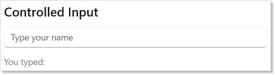
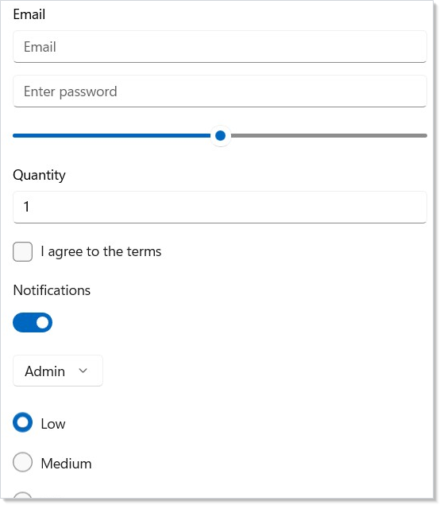
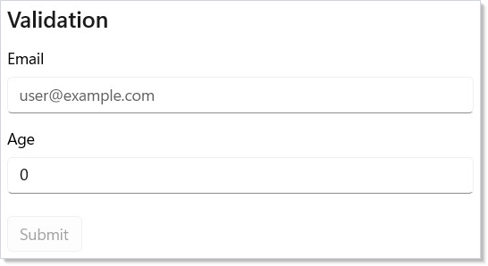
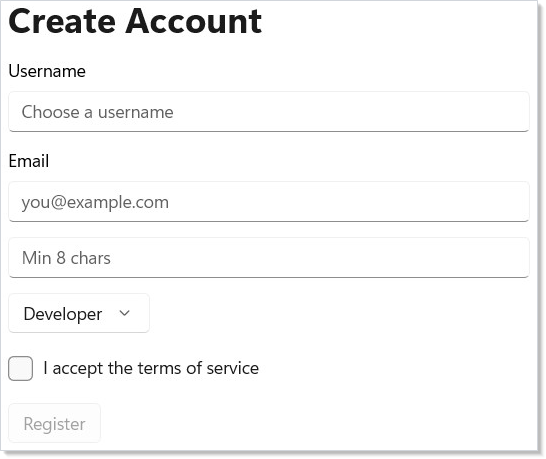

# Forms and Input

Every form control in Duct follows the controlled-input pattern: you own the
value, you provide the change handler, and the control reflects your state.
There is no two-way binding. The data always flows one direction.

## The Controlled-Input Pattern

Pass the current value and a setter. When the user types, `onChange` fires
with the new value. You call the setter, Duct re-renders, and the control
shows the updated text:

```csharp
class ControlledInputDemo : Component
{
    public override Element Render()
    {
        var (name, setName) = UseState("");

        return VStack(12,
            SubHeading("Controlled Input"),
            TextField(name, setName, placeholder: "Type your name"),
            Text($"You typed: {name}").Opacity(0.6)
        ).Padding(24);
    }
}
```



This is the same [`UseState`](hooks.md) pattern from [Getting Started](getting-started.md),
applied to form inputs. The control never holds its own state — your component
is the single source of truth.

## Input Control Types

Duct provides controls for every common input type. Each follows the same
pattern: current value in, change handler out.

```csharp
class InputTypesDemo : Component
{
    public override Element Render()
    {
        var (text, setText) = UseState("");
        var (password, setPassword) = UseState("");
        var (volume, setVolume) = UseState(50.0);
        var (count, setCount) = UseState(1.0);
        var (agree, setAgree) = UseState(false);
        var (notify, setNotify) = UseState(true);
        var (role, setRole) = UseState(0);
        var (priority, setPriority) = UseState(0);

        return VStack(12,
            TextField(text, setText, placeholder: "Email",
                header: "Email"),
            PasswordBox(password, setPassword,
                placeholderText: "Enter password"),
            Slider(volume, 0, 100, setVolume),
            NumberBox(count, setCount, header: "Quantity"),
            CheckBox(agree, setAgree, label: "I agree to the terms"),
            ToggleSwitch(notify, setNotify,
                header: "Notifications"),
            ComboBox(["Admin", "Editor", "Viewer"],
                role, setRole),
            RadioButtons(["Low", "Medium", "High"],
                priority, setPriority)
        ).Padding(24);
    }
}
```



| Control | Value type | Change handler |
|---------|-----------|---------------|
| `TextField` | `string` | `Action<string>` |
| `PasswordBox` | `string` | `Action<string>` |
| `Slider` | `double` | `Action<double>` |
| `NumberBox` | `double` | `Action<double>` |
| `CheckBox` | `bool` | `Action<bool>` |
| `ToggleSwitch` | `bool` | `Action<bool>` |
| `ComboBox` | `int` (index) | `Action<int>` |
| `RadioButtons` | `int` (index) | `Action<int>` |

All controls accept optional parameters for labels, headers, and placeholder
text. Check the API reference for each control's full signature.

## Validation

Since your component owns all form state, validation is plain C# logic. Derive
booleans from the current values and use them to show error messages and
disable the submit button:

```csharp
class ValidationDemo : Component
{
    public override Element Render()
    {
        var (email, setEmail) = UseState("");
        var (age, setAge) = UseState(0.0);

        var emailValid = email.Contains('@') && email.Contains('.');
        var ageValid = age >= 18 && age <= 120;
        var formValid = emailValid && ageValid
            && !string.IsNullOrWhiteSpace(email);

        return VStack(12,
            SubHeading("Validation"),
            TextField(email, setEmail, placeholder: "user@example.com",
                header: "Email"),
            When(!string.IsNullOrEmpty(email) && !emailValid, () =>
                Text("Enter a valid email address")
                    .Foreground("#d13438").FontSize(12)),
            NumberBox(age, setAge, header: "Age"),
            When(age > 0 && !ageValid, () =>
                Text("Age must be between 18 and 120")
                    .Foreground("#d13438").FontSize(12)),
            Button("Submit", () => { })
                .Disabled(!formValid)
                .Margin(0, 8, 0, 0)
        ).Padding(24);
    }
}
```



Key patterns:

- **Derive validity from state.** `emailValid` and `ageValid` are computed on
  every render. No validation framework needed.
- **`When()` for conditional messages.** Show error text only when the field
  has been touched and is invalid.
- **`.Disabled(!formValid)`** prevents submission until all fields pass.

## Putting It Together: Registration Form

Here is a complete registration form that combines multiple input types,
validation, and a submit action:

```csharp
class RegistrationForm : Component
{
    public override Element Render()
    {
        var (username, setUsername) = UseState("");
        var (email, setEmail) = UseState("");
        var (password, setPassword) = UseState("");
        var (role, setRole) = UseState(0);
        var (acceptTerms, setAcceptTerms) = UseState(false);
        var isValid = !string.IsNullOrWhiteSpace(username)
            && email.Contains('@') && password.Length >= 8 && acceptTerms;

        return VStack(12,
            Heading("Create Account"),
            TextField(username, setUsername, placeholder: "Choose a username",
                header: "Username"),
            TextField(email, setEmail, placeholder: "you@example.com",
                header: "Email"),
            PasswordBox(password, setPassword, placeholderText: "Min 8 chars"),
            When(password.Length > 0 && password.Length < 8, () =>
                Text("Password too short").Foreground("#d13438").FontSize(12)),
            ComboBox(["Developer", "Designer", "Manager"], role, setRole),
            CheckBox(acceptTerms, setAcceptTerms,
                label: "I accept the terms of service"),
            Button("Register", () => { }).Disabled(!isValid)
        ).Padding(24);
    }
}
```



After submission, the component switches to a confirmation view. The
`setSubmitted(true)` call triggers a re-render, and the early return at the
top of `Render()` shows the success message instead of the form.

## Tips

**Always use controlled inputs.** Never let a control manage its own state.
Your `Render()` method is the single source of truth — if you need to
pre-fill, validate, or reset a field, you just set the state value.

**Derive validation, don't store it.** Instead of keeping `isEmailValid` in
state, compute it from `email` on every render. This eliminates sync bugs
where validation state gets out of date with the actual value.

**Use `When()` for inline error messages.** It reads cleanly and avoids
extra nesting compared to if/else blocks in the middle of your element tree.

**Reset forms by resetting state.** Call every setter with its initial value.
Since your component owns all state, there is no hidden form state to clear.

**Group related fields visually.** Use [`VStack`](layout.md) with spacing to group
related inputs, and `SubHeading` or `Text().Bold()` to label each section of a
longer form.

## Next Steps

- **[Flex Layout](flex-layout.md)** — advanced alignment and wrapping for complex form layouts
- **[Collections](collections.md)** — render lists, grids, and virtualized data sets
- **[Hooks](hooks.md)** — UseState, UseMemo, and other hooks that power form logic
- **[Commanding](commanding.md)** — wire submit buttons to async commands with busy/error handling
