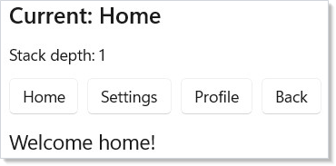
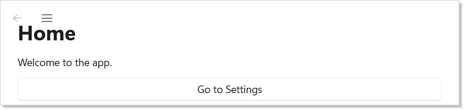
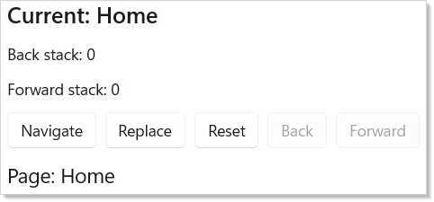
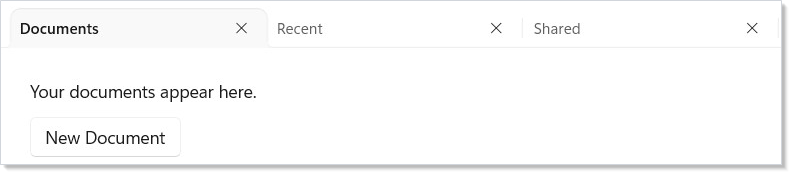

# Navigation

Duct uses a stack-based navigation model with type-safe routes. You define
your routes as an enum, create a navigation handle with
[`UseNavigation`](hooks.md), and render the current page with `NavigationHost`.

## Defining Routes

Start by defining an enum for your pages:

```csharp
enum Route { Home, Settings, Profile, Details }
```

Each enum value represents a distinct page in your app. The navigation system
uses this type to ensure you can only navigate to valid routes.

## Basic Navigation

Call `UseNavigation(Route.Home)` to create a navigation handle rooted at
your initial route. Use `NavigationHost` to render the current page:

```csharp
class BasicNavDemo : Component
{
    public override Element Render()
    {
        var nav = UseNavigation(Route.Home);

        return VStack(12,
            SubHeading($"Current: {nav.CurrentRoute}"),
            Text($"Stack depth: {nav.Depth}"),
            HStack(8,
                Button("Home", () => nav.Navigate(Route.Home)),
                Button("Settings", () => nav.Navigate(Route.Settings)),
                Button("Profile", () => nav.Navigate(Route.Profile)),
                Button("Back", () => nav.GoBack())
                    .Disabled(!nav.CanGoBack)
            ),
            NavigationHost(nav, route => route switch
            {
                Route.Home => Text("Welcome home!").FontSize(18).Padding(16),
                Route.Settings => Text("Settings page").FontSize(18).Padding(16),
                Route.Profile => Text("Your profile").FontSize(18).Padding(16),
                _ => Text("Not found").Padding(16)
            })
        ).Padding(24);
    }
}
```



Here is what each piece does:

- **`UseNavigation(Route.Home)`** creates a `NavigationHandle<Route>` with
  `Home` as the initial route. Call this once in your root component.
- **`nav.Navigate(route)`** pushes a new route onto the stack.
- **`nav.GoBack()`** pops the current route and returns to the previous one.
- **`NavigationHost(nav, route => ...)`** renders whichever element the
  route map returns for the current route.

## NavigationView

`NavigationView` creates a sidebar menu with icons. Pair it with
`NavigationHost` for a standard app layout:

```csharp
class NavViewDemo : Component
{
    public override Element Render()
    {
        var nav = UseNavigation(Route.Home);
        return NavigationView(
            [
                NavItem("Home", icon: "Home", tag: "Home"),
                NavItem("Settings", icon: "Setting", tag: "Settings"),
                NavItem("Profile", icon: "Contact", tag: "Profile")
            ],
            content: NavigationHost(nav, route => route switch
            {
                Route.Home => VStack(12, Heading("Home"),
                    Text("Welcome to the app."),
                    Button("Go to Settings",
                        () => nav.Navigate(Route.Settings))).Padding(24),
                Route.Settings => VStack(12, Heading("Settings"),
                    Text("Configure your preferences."),
                    Button("Back", () => nav.GoBack())).Padding(24),
                Route.Profile => VStack(12, Heading("Profile"),
                    Text("View your profile info.")).Padding(24),
                _ => Text("Not found").Padding(24)
            })
        );
    }
}
```



`NavItem` takes a label, an optional icon name (from the Segoe Fluent Icons
font), and an optional tag string. The `NavigationView` handles selection
state and displays the content you pass.

## Stack Operations

The `NavigationHandle` supports several stack manipulation methods beyond
simple push and pop:

```csharp
class StackOperationsDemo : Component
{
    public override Element Render()
    {
        var nav = UseNavigation(Route.Home);

        return VStack(12,
            SubHeading($"Current: {nav.CurrentRoute}"),
            Text($"Back stack: {nav.BackStack.Count}"),
            Text($"Forward stack: {nav.ForwardStack.Count}"),
            HStack(8,
                Button("Navigate", () =>
                    nav.Navigate(Route.Settings)),
                Button("Replace", () =>
                    nav.Replace(Route.Profile)),
                Button("Reset", () =>
                    nav.Reset(Route.Home)),
                Button("Back", () => nav.GoBack())
                    .Disabled(!nav.CanGoBack),
                Button("Forward", () => nav.GoForward())
                    .Disabled(!nav.CanGoForward)
            ),
            NavigationHost(nav, route =>
                Text($"Page: {route}")
                    .FontSize(18).Padding(16))
        ).Padding(24);
    }
}
```



| Method | Effect |
|--------|--------|
| `Navigate(route)` | Push route onto back stack, navigate to it |
| `GoBack()` | Pop current, return to previous |
| `GoForward()` | Move forward (after going back) |
| `Replace(route)` | Swap current route without touching the stack |
| `Reset(route)` | Clear all stacks, start fresh at route |
| `PopTo(predicate)` | Pop until a matching route is found |

Use `CanGoBack` and `CanGoForward` to enable/disable navigation buttons.

## Page Lifecycle

`UseNavigationLifecycle` lets a component react to navigation events. Use it
to load data when a page appears or save state when it disappears:

```csharp
class LifecyclePage : Component
{
    public override Element Render()
    {
        var (log, updateLog) = UseReducer(new List<string>());

        UseNavigationLifecycle(
            onNavigatedTo: ctx =>
                updateLog(l => [.. l,
                    $"Arrived from {ctx.PreviousRoute}"]),
            onNavigatingFrom: ctx =>
                updateLog(l => [.. l,
                    $"Leaving to {ctx.TargetRoute}"]),
            onNavigatedFrom: ctx =>
                updateLog(l => [.. l,
                    $"Left for {ctx.TargetRoute}"])
        );

        return VStack(8,
            SubHeading("Lifecycle Events"),
            VStack(4,
                log.TakeLast(5).Select(entry =>
                    Text(entry).FontSize(12).Opacity(0.7)
                ).ToArray()
            )
        ).Padding(16);
    }
}
```


The three callbacks fire at different points:

| Callback | When it fires |
|----------|--------------|
| `onNavigatedTo` | After this page becomes active |
| `onNavigatingFrom` | Before leaving this page (can inspect target) |
| `onNavigatedFrom` | After this page is no longer active |

Use `onNavigatedTo` to fetch data or start timers. Use `onNavigatingFrom` to
save drafts or confirm unsaved changes. See [Effects and Lifecycle](effects.md)
for more on lifecycle patterns.

## TabView

For tab-based navigation, use `TabView` with `Tab` items. Each tab holds its
own content independently:

```csharp
class TabNavDemo : Component
{
    public override Element Render()
    {
        return TabView(
            Tab("Documents",
                VStack(12,
                    Text("Your documents appear here."),
                    Button("New Document", () => { })
                ).Padding(24)
            ),
            Tab("Recent",
                VStack(12,
                    Text("Recently opened files."),
                    Text("No recent files.").Opacity(0.5)
                ).Padding(24)
            ),
            Tab("Shared",
                VStack(12,
                    Text("Files shared with you."),
                    Text("Nothing shared yet.").Opacity(0.5)
                ).Padding(24)
            )
        );
    }
}
```



Unlike stack-based navigation, tabs keep all their content alive simultaneously.
Use tabs when users need to switch freely between parallel workspaces.

## Tips

**Use enums for routes.** Enums give you compile-time safety — you cannot
navigate to a route that does not exist. For routes that carry data (like a
detail page ID), use a discriminated union pattern with records.

**Call `UseNavigation(initial)` once at the root.** Child components access
the same handle with `UseNavigation<Route>()` (no initial value). This
retrieves the nearest ancestor's handle via [context](context.md).

**Prefer `Navigate` over `Replace` for user-initiated actions.** `Navigate`
preserves history so the user can go back. Use `Replace` for programmatic
redirects where back-navigation would not make sense (like after login).

**Use `Reset` for sign-out flows.** It clears the entire stack and starts
fresh, preventing the user from navigating back to authenticated pages.

**Pair `UseSystemBackButton` with your nav handle.** Call
`UseSystemBackButton(nav, window)` to wire the system back button (title bar
or hardware) to your navigation stack automatically.

## Next Steps

- **[Collections](collections.md)** — render data-driven lists and grids within pages
- **[Styling and Theming](styling.md)** — apply visual styles and themes across pages
- **[Context](context.md)** — share navigation handles and other state across the component tree
- **[Effects and Lifecycle](effects.md)** — run side effects when pages appear or disappear
