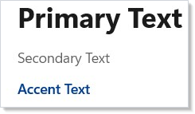
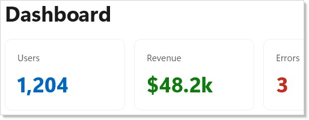
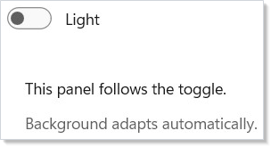

# Styling and Theming

Duct uses WinUI's built-in theme system. Instead of hardcoding colors, you
reference semantic tokens that automatically adapt to light mode, dark mode,
and high contrast. The `Theme` class exposes these tokens as `ThemeRef` values
you can pass to any color modifier. These modifiers work on any
[component](components.md) that supports background or foreground properties.

## Theme Tokens

Apply a theme token with `.Background()` or `.Foreground()`:

```csharp
class ThemeTokensExample : Component
{
    public override Element Render()
    {
        return VStack(12,
            Text("Primary Text").Foreground(Theme.PrimaryText),
            Text("Secondary Text").Foreground(Theme.SecondaryText),
            Text("Accent Text").Foreground(Theme.AccentText).SemiBold(),
            Text("On Accent Background")
                .Foreground("#FFFFFF")
                .Padding(8, 4)
                .Background(Theme.Accent)
                .CornerRadius(4)
        ).Padding(24);
    }
}
```



Each token maps to a WinUI resource brush. When the user switches between light
and dark mode, every element using a `ThemeRef` updates automatically — no
manual rebinding needed.

## Building Cards

A card is a `Border` with a background, rounded corners, padding, and a subtle
stroke. Combine these modifiers with [layout containers](layout.md) to build
reusable card layouts:

```csharp
class CardLayoutExample : Component
{
    public override Element Render()
    {
        return VStack(16,
            Heading("Dashboard"),
            HStack(12,
                Card("Users", "1,204", Theme.Accent),
                Card("Revenue", "$48.2k", Theme.SystemSuccess),
                Card("Errors", "3", Theme.SystemCritical)
            )
        ).Padding(24);
    }

    static Element Card(string title, string value, ThemeRef accent) =>
        Border(
            VStack(8,
                Caption(title).Foreground(Theme.SecondaryText),
                Text(value).FontSize(28).Bold().Foreground(accent)
            ).Padding(16)
        ).Background(Theme.CardBackground)
         .CornerRadius(8)
         .WithBorder(Theme.CardStroke, 1)
         .Width(160);
}
```



`Theme.CardBackground` gives you the standard WinUI card surface color.
`Theme.CardStroke` adds the matching border. Together they produce a card that
looks native in both light and dark mode.

## Color Modifiers

You can pass three types of values to `.Background()` and `.Foreground()`:

```csharp
class ColorModifiersExample : Component
{
    public override Element Render()
    {
        return VStack(8,
            Text("Theme token").Background(Theme.SubtleFill).Padding(8),
            Text("Hex string").Background("#E8F5E9").Padding(8),
            Text("Mixed").Foreground(Theme.PrimaryText)
                .Background("#1E1E2E").Padding(8)
        ).Padding(24);
    }
}
```

| Overload | Example |
|----------|---------|
| Theme token | `.Background(Theme.Accent)` |
| Hex string | `.Background("#FF5733")` |
| `Windows.UI.Color` | `.Background(Colors.Blue)` |

Theme tokens are preferred because they respect the system theme. Use hex
strings for brand colors that should stay constant regardless of mode.

## Signal Colors

WinUI provides semantic signal colors for status indicators. Duct exposes them
through `Theme`:

```csharp
class SignalColorsExample : Component
{
    public override Element Render()
    {
        return HStack(12,
            Badge("Info", Theme.SystemAttention),
            Badge("Success", Theme.SystemSuccess),
            Badge("Warning", Theme.SystemCaution),
            Badge("Error", Theme.SystemCritical)
        ).Padding(24);
    }

    static Element Badge(string label, ThemeRef color) =>
        Text(label)
            .FontSize(12).SemiBold()
            .Foreground(color)
            .Padding(8, 4)
            .Background(Theme.SubtleFill)
            .CornerRadius(4);
}
```


Use these instead of hardcoded red/green/yellow — they meet
[accessibility](accessibility.md) contrast requirements in both themes.

## Dark and Light Mode

Toggle the theme on a subtree by setting `RequestedTheme` through the `.Set()`
escape hatch:

```csharp
class DarkLightToggleExample : Component
{
    public override Element Render()
    {
        var (isDark, setIsDark) = UseState(false);

        return VStack(16,
            ToggleSwitch(isDark, setIsDark, onContent: "Dark", offContent: "Light"),
            Border(
                VStack(12,
                    Text("This panel follows the toggle.").Foreground(Theme.PrimaryText),
                    Text("Background adapts automatically.").Foreground(Theme.SecondaryText)
                ).Padding(16)
            ).Background(Theme.CardBackground)
             .CornerRadius(8)
             .Set(b => b.RequestedTheme = isDark ? ElementTheme.Dark : ElementTheme.Light)
        ).Padding(24);
    }
}
```



`.Set()` gives you direct access to the underlying WinUI control. Use it
sparingly for properties Duct doesn't expose as fluent modifiers.

## Custom Resource Access

Access any WinUI theme resource by key name with `Theme.Ref()`:

```csharp
class CustomResourceExample : Component
{
    public override Element Render()
    {
        return VStack(12,
            Text("Using a named WinUI resource:")
                .Foreground(Theme.PrimaryText),
            Text("NavigationViewItemForeground")
                .Foreground(Theme.Ref("NavigationViewItemForeground"))
        ).Padding(24);
    }
}
```

This is useful when you need a resource that `Theme` doesn't expose as a
named property. The key must exist in WinUI's resource dictionaries.

## Tips

**Prefer theme tokens over hex colors.** Tokens adapt to light/dark mode and
high contrast automatically. Reserve hex for brand colors.

**Use `Theme.CardBackground` + `Theme.CardStroke` for card containers.** This
matches the WinUI design language exactly.

**Keep `.Set()` calls minimal.** If you find yourself using `.Set()` often for
the same property, that's a sign the framework should add a modifier — file a
feature request.

**Combine `CornerRadius`, `Padding`, and `Background` for visual grouping.**
Rounded containers with subtle backgrounds help users scan complex layouts.

**Test in both themes.** Run your app, switch Windows to dark mode, and verify
nothing becomes unreadable. Theme tokens handle this if you avoid hardcoded
colors.

## Next Steps

- **[Navigation](navigation.md)** — Previous: route between pages and manage navigation history
- **[Effects and Lifecycle](effects.md)** — Next: run side effects on mount, update, and cleanup
- **[Context](context.md)** — Provide theme values to an entire subtree without prop drilling
- **[Accessibility](accessibility.md)** — Ensure themed colors meet contrast requirements
- **[Components](components.md)** — Build the visual elements that consume your theme tokens
